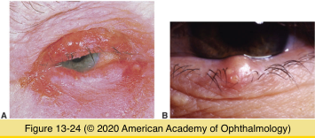
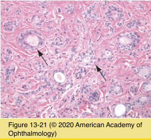
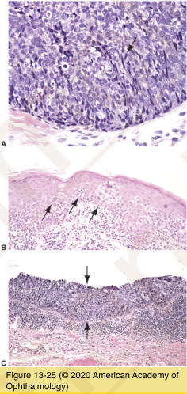
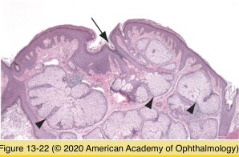
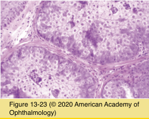

# 4.13.4. Eyelids (IV): Neoplasia (II): Appendage Neoplasms

## Images

## Hierarchy

- Syringoma
  - rare
    - young females
      - more apparent during puberty
  - clinical
    - lower lid
    - small, waxy, elevated nodules
      - multiple
      - 1–2 mm in diameter
      - axilla
      - sternal region
  - histology
    - originate from eccrine sweat gland ducts
      - double layer of epithelium
    - multiple comma-shaped/round ductules
      - central lumen with secretory material
  - treatment
    - located within the dermis
      - too deep for shave excision
    - complete surgical excision
      - staged fashion
- Sebaceous carcinoma
  - clinical
    - elderly
      - in contrast to BCC & SCC
      - upper eyelid
    - worse survival rate compared with squamous carcinoma
    - metastasis
      - regional lymph nodes
  - origin
    - meibomian glands of tarsus
    - Zeis glands of eyelid
    - sebaceous glands of caruncle
  - histology
    - well-differentiated
      - microvesicular foamy (vacuolated) cytoplasm (lipid)
        - diagnostic!
        - frozen section slides for lipid stains
          - oil red O
          - Sudan black
          - before processing and paraffin embedding
    - poorly differentiated
      - difficult to distinguish from other epithelial malignancies
    - pagetoid spread
      - individual cells/cluster of cells within epidermis/epithelium
      - characteristic but not pathognomonic
    - sebaceous carcinoma in situ
      - complete replacement of conjunctival epithelium by tumor cells
  - treatment
    - preoperative mapping
    - wide local excision
      - surgical margin control
        - permanent sections
        - frozen sections
        - Mohs micrographic surgery
        - less reliable
    - exenteration
- Sebaceous hyperplasia
  - small yellow papule
  - single enlarged sebaceous gland
    - numerous glandular lobules
- sebaceous adenoma
  - yellow circumscribed nodule
  - multiple sebaceous lobules
    - irregularly shaped
    - incompletely differentiated
    - basophilic sebocytes
  - rule out Muir-Torre syndrome
    - keratoacanthoma; sebaceous adenoma/ carcinoma
    - autosomal dominant; visceral (colon) carcinoma
