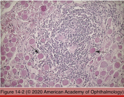
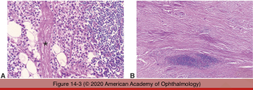
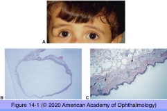
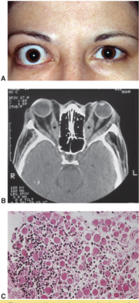

# 4.14.1. Orbit (I)

## Images

## Hierarchy

- Nonspecific orbital inflammation (idiopathic orbital inflammation)
  - demographics
    - 5% of orbital lesions
    - adults and children
  - clinical
    - abrupt onset
    - pain
    - diffuse
    - compartmentalized
      - extraocular muscles
        - orbital myositis
      - lacrimal gland
        - dacryoadenitis
    - may simulate a neoplasm
      - "orbital pseudotumor"
  - histology
    - early
      - polymorphous inflammatory response
        - polyclonal
        - perivascular
        - infiltrates muscle
          - involves muscle tendons!
        - infiltrates fat
          - fat necrosis
        - CD20 and CD25 receptors
        - IgG4-positive plasmacytic infiltrate
          - sclerosing variant of fibroinflammatory disease
    - late
      - fibrosis
        - may encase extraocular muscles and optic nerve
          - fibrosing/sclerosing orbititis
      - interspersed lymphoid follicles with germinal centers
- Topography
  - 7 bones
    - frontal
    - zygomatic
    - palatine
    - lacrimal
    - sphenoid
    - ethmoid
    - maxillary
    - roof composed of
      - orbital plate of the frontal bone
      - lesser wing of the sphenoid bone
    - lateral wall composed of
      - zygomatic bone
      - maxillary bone
        - greater wing of the sphenoid bone
          - separated from the lesser wing by the superior orbital fissure
    - floor composed of
      - palatine bone
      - zygomatic bone
    - medial wall composed of
      - orbital plate of the ethmoid bone
      - lacrimal bone
        - only the lacrimal bone exists wholly within the orbital confines
      - frontal process of the maxillary bone
      - lesser wing of the sphenoid bone
        - also part of orbital roof
  - 30 ml
  - proptosis vs. displacement
  - lacrimal gland
    - acini
      - divided into 2 lobes by aponeurosis of levator palpebrae superioris
        - orbital
        - palpebral
      - low cuboidal epithelium
    - ducts
      - low cuboidal epithelium
      - low flat myoepithelial cells
- mast cells
  - generally found on B-cells
    - attaches & activates
- Congential anomalies
  - Congenital cysts of surface epithelium
    - Dermoid cyst
      - most common
      - from embryonic epithelial nests
      - manifests in childhood
      - orbital mass
        - superotemporal orbit
        - cyst rupture --> granulomatous inflammation
        - protrusion through frontozygomatic or frontomaxillary sutures
          - dumbbell shape
      - histology
        - capsule
        - wall
          - sebaceous glands
          - hair follicles
          - sweat glands
        - lined by keratinized stratified squamous epithelium
        - contains
          - keratin
          - hair
    - Simple epithelial (epidermoid) cyst
      - no adnexal structures
      - lined by
        - respiratory epithelium
        - conjunctival epithelium
        - apocrine epithelium
- Thyroid eye disease
  - most common cause of unilateral or bilateral proptosis in adults
  - terminology
    - Graves disease
    - thyroid ophthalmopathy
    - thyroid-associated orbitopathy
  - pathogenesis
    - inflammation of orbital connective tissue
      - lymphocytes
        - T-cell-bound CD154
          - express CD40 receptors
            - upregulate fibroblast inflammatory genes
              - IL-6
              - IL-8
              - PGE2
                - increased synthesis of hyaluronan & glycosaminoglycans
      - plasma cells
      - fibroblasts
        - express TSH-R
          - higher numbers in early disease
            - decreases with disease duration
            - correlates with serum TSH-R antibody levels
            - up-regulates TSH-R mRNA
        - express IGF-I receptor
          - activated by circulating IgG
            - secrete
              - glycosaminoglycans
                - promotes adipocyte differentiation/ adipogenesis
              - cytokines
              - chemoattractants
            - insulin-like growth factor
    - inflammation and fibrosis of extraocular muscles
      - firm white muscles
      - TED does not involve muscle tendons!
        - fusiform enlargement
      - inferior & medial rectus muscles
    - adipogenesis
- Amyloid
  - primary systemic amyloidosis
  - can involve extraocular muscles & nerves
    - ophthalmoplegia
    - ptosis
- Orbital inflammatory diseases
  - types
    - idiopathic
    - secondary
      - systemic inflammatory disease
      - foreign body
      - infections
  - differential diagnosis
    - congenital mass lesions
    - neoplastic diseases
      - lymphoma
      - rhabdomyoscarcoma
