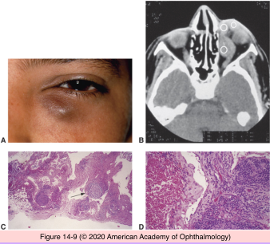
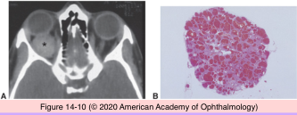
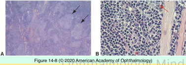

# 4.14.3. Orbit (III): Neoplasia (I)

## Images

## Hierarchy

- general
  - types
    - primary
      - less common
        - lymphoma
          - 10%
        - cavernous hemangioma
          - 5%
    - secondary
      - more common
      - from adjacent structures
      - metastatic disease
  - benign vs. malignant
    - benign
      - 60%
      - more common in children
        - 90%
      - cystic lesions
        - 50% of orbital lesions in childhood
    - malignant
      - 40%
      - more common in adults
- Lacrimal sac neoplasia
  - rare
  - difficult to get a representative biopsy with endoscopic procedures
  - dacryocystorhinostomy
    - 5% neoplasm rate
      - 2% unsuspected
- Vascular tumors
  - Lymphangioma
    - children
    - fluctuating proptosis
    - histology
      - diffusely infiltrating
      - unencapsulated
      - lymphatic vascular spaces
      - lymphoid aggregates
      - fibrotic interstitium
  - Cavernous hemangioma
    - adults
    - histology
      - encapsulated
      - cavernous spaces
        - thick fibrosed walls
        - thrombosis
        - calcification
  - Capillary hemangioma
    - children
    - histology
      - capillary-sized vessels
      - unencapsulated
      - more cellular
- Lymphoproliferative lesions
  - general
    - clinical
      - proptosis
        - gradual
        - painless
    - systemic evaluation
      - physical examination
        - lymphadenopathy
          - lymph node biopsy preferred over orbital biopsy
      - CBC & differential
      - imaging of thorax & abdomen
      - +- bone marrow biopsy
        - paratrabecular lymphoid infiltrate
        - preferred to aspiration
    - treatment
      - radiation
    - tissue processing
      - communicate with pathologist in advance!
      - fresh (unfixed) tissue
        - preferred for
          - touch preperation
          - immunohistochemistry
          - flow cytometry
          - gene rearrangement
        - avoid long periods of exposure to air
        - wrap in saline-moistened gauze and transport on ice
        - handle gently
  - Reactive lymphoid hyperplasia
    - lymphocytes
      - well-differentiated
      - pleomorphic
    - mitotic activity
      - follicles with germinal centers
        - tingible body macrophages
          - contain phagocytized apoptotic cellular debris/ condensed chromatin fragments
    - vessels with endothelial activity
    - plasma cells
    - macrophages
    - eosinophils
  - Atypical lymphoid hyperplasia
    - lacks reactive germinal centers
    - admixture of
      - small mature-appearing lymphocytes
      - larger lymphoid cells of questionable maturity
  - Lymphoma
    - types
      - primary
      - systemic lymphoma (secondary)
        - 1-2% of systemic lymphoma are associated with orbital lymphoma
    - Hodgkin lymphoma exceedingly rare in orbit
      - multinucleated Reed-Sternberg cells
      - positive immunohistochemistry for
        - CD15
        - CD30
        - CD45
    - non-Hodgkin lymphoma
      - 1/2 of malignancies in orbit/ocular adnexa
      - immunohistochemistry
        - B cell
          - CD19
          - CD20
        - T cell
          - rare
          - CD3, CD4, CD5
- Soft tissue tumors
  - histologic patterns
    - round cell
    - spindle cell
    - myxoid
    - epithelial
    - pericytomatous
    - pleomorphic
  - immunohistochemistry panel
    - CD34
    - CD68
    - CD99
    - S-100
    - vimentin
    - actin
    - desmin
  - malignant (sarcoma)
    - 2 groups
      - specific genetic alterations (simple karyotypes)/oncogenic mutations
        - FUS-DDIT3 in myxoid sarcoma
        - KIT mutation in GI stromal tumors
      - nonspecific genetic alterations (complex karyotypes)
- Metastatic tumors
  - secondary tumors
    - direct extension from adjacent structures
  - metastatic tumors
    - spread from a primary site
      - breast
        - women
      - prostate
        - men
      - neuroblastoma
        - children
- Adipose tumors
  - Lipoma
    - rare
    - encapsulated
    - lobular appearance
  - Liposarcoma
    - extremely rare
    - lipoblasts
    - recur before metastasizing
