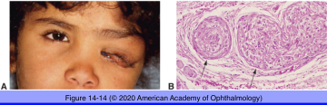
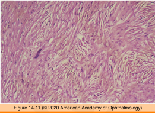
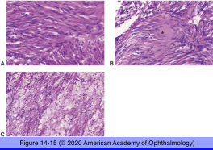
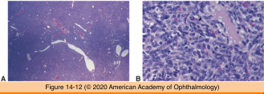
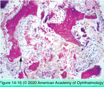
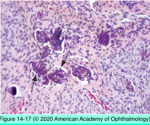

# 4.14.5. Orbit (V): Neoplasia (III)

## Images

## Hierarchy

- Nerve sheath tumors
  - Neurofibroma
    - most common nerve sheath tumor
    - clinical
      - slow-growing
      - firm/rubbery
        - endoneural fibroblasts
    - histology
      - cells
        - Schwann cells
        - axons
      - arranged in ribbons/cords
      - matrix of myxoid tissue and collagen
        - contains axons
      - not encapsulated
    - chromosome 9p rearrangement
    - isolated neurofibromas
      - no systemic involvement
    - plexiform neurofibromas
      - neurofibromatosis type 1
      - S-shaped deformity of upper eyelid
      - CCN1 gene
        - CCNs
          - matricellular proteins
            - connect cell surface and extracellular matrix
  - Neurilemoma (schwannoma)
    - arise from Schwann cells
    - slow growing
      - encapsulated
    - associations
      - solitary
      - associated with neurofibromatosis
    - histology
      - patterns
        - Antoni A pattern
          - interlacing whorls/cords/palisades of spindle cells
        - Antoni B pattern
          - mucoid stroma
            - Verocay bodies
              - fibrils resembling sensory corpuscles
            - stellate cells
      - cysts
      - hemorrhagic necrosis
      - prominent thick-walled vessels
        - in contrast to neurofibromas
      - no axons
    - immunohistochemistry
      - S-100
      - vimentin
      - CD68
- Tumors with fibrous proliferation
  - Fibrous histiocytoma (fibroxanthoma)
    - similar to embryonal RMS
    - adults
      - median age=43 years
        - 6 mo - 85 years
    - upper nasal orbit
    - histology
      - fibroblasts
        - storiform/whorly/matlike pattern
      - histiocytes
      - immunohistochemistry
        - CD45
        - CD68
    - clinical behavior
      - benign
        - most common
      - intermediate
      - malignant
        - high mitosis rate
          - .>1/HPF
        - nuclear pleomorphism
        - necrosis
        - <10% have metastatic potential
      - locally aggressive
    - difficult to distinguish, clinically and histologically, from hemangiopericytoma
  - Hemangiopericytoma
    - solitary fibrous tumor is part of hemangiopericytoma spectrum
    - uncommon
    - adults
      - median age=42 years
    - clinical
      - proptosis
        - similar to adenoid cystic carcinoma of lacrimal gland
          - similar to fibrous histiocytoma
      - diplopia
        - pain
      - decreased visual acuity
        - staghorn vascular pattern
    - pathology
      - hypervascular
      - hypercellular
        - plump pericytes that surround a rich capillary network
        - densely packed spindle-shaped cells
        - reticulin stain
          - individual tumor cells wrapped in collagenous material
      - encapsulated
      - no correlation between mitotic rate and clinical behavior
        - microscopically “benign” lesions may recur and metastasize
        - microscopically “malignant” lesions may remain localized
        - high mitosis rate
      - immunohistochemistry
        - CD34
    - resembles cavernous hemangiomas on CT and MRI
    - clinical behavior
      - benign
        - ?
        - most common
      - intermediate
      - malignant
        - infiltrating border
        - anaplasia
        - necrosis
          - may recur, undergo malignant degeneration, or metastasize
    - treatment
      - complete excision
      - appear bluish intraoperatively
- Bony lesions
  - Fibrous dysplasia
    - types
      - monostotic
      - polyostotic
    - orbital involvment is monostotic
    - first 3 decades
    - may cross suture lines
    - narrowing of optic canal
    - narrowing of lacrimal drainage system
    - plain radiograph
      - ground-glass appearance
      - lytic foci
      - cysts containing fluid
    - histology
      - bony trabeculae
        - immature woven bone
        - C-shaped
      - highly vascularized fibrous stroma
  - Fibro-osseus dysplasia (juvenile ossifying fibroma)
    - histology
      - bone spicules
        - rimmed by osteoblasts
      - cellular fibrous stroma
    - differential diagnosis
      - psammomatous meningioma
  - osseous/cartilaginous tumors
    - osteoma
      - most common
      - slow growing
      - well circumscribed
      - mature bone
      - frontal sinus
    - osteoblastoma
    - giant cell tumor
    - chondroma
    - Ewing sarcoma
    - osteogenic sarcoma
    - chondrosarcoma
- Smooth muscle tumors
  - rare
  - Leiomyoma
    - 4th and 5th decade
    - proptosis
      - slowly progressive
    - spindle cells
      - nuclei
        - blunt-ended
        - cigar-shaped
      - cytoplasm
        - filamentous
        - trichrome-positive
  - Leiomyosarcoma
    - 7th decade
    - histology
      - have more
        - cellularity
        - necrosis
        - nuclear pleomorphism
        - mitotic figures
