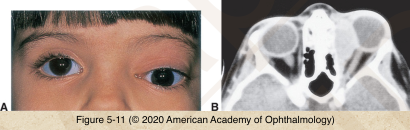
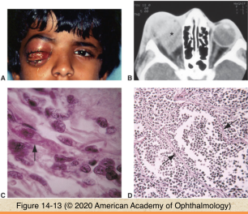

# 4.14.6. Orbit (VI): Neoplasia (IV): Rhabdomyosarcoma

## Images

## Hierarchy

- origin
  - most common primary malignant orbital tumor of childhood
  - primitive undifferentiated pluripotential mesenchymal cells that differentiate toward skeletal muscle
    - not from the extraocular muscles
- clinical presentation
  - average age=7-8 years
  - sudden onset and rapid progression of unilateral proptosis
  - less dramatic course in patients in their early teens
    - gradually progressive proptosis lasting weeks to > 1 month
  - edema & reddish discoloration of eyelids
    - NOT accompanied by local heat or fever
  - ptosis
  - strabismus
  - ± palpable mass
    - particularly in the superonasal quadrant of the eyelid
    - may be retrobulbar
    - may involve any quadrant of the orbit
    - may rarely arise from the conjunctiva
  - unrelated history of trauma can lead to delay in diagnosis and treatment
- diagnostic workup
  - should proceed urgently
  - CT and MRI
    - to define the location and extent of the tumor
  - biopsy
    - anterior orbitotomy
    - often possible to completely remove a rhabdomyosarcoma if it has a pseudocapsule
    - in diffusely infiltrating tumors, a large biopsy specimen should be obtained so that adequate material is available for
      - frozen sections
        - the smaller the residual tumor, the more effective the combination of adjuvant radiation and chemotherapy in achieving a cure
        - permanent light-microscopy sections
      - electron microscopy
        - immunohistochemistry
    - cross-striations are often not visible on light microscopy
      - more readily apparent on electron microscopy
  - palpate the cervical and preauricular lymph nodes
    - to evaluate for regional metastases
  - chest radiography
  - bone marrow aspiration and biopsy
    - under anesthesia at the time of the initial orbital biopsy
  - lumbar puncture
- treatment
  - Intergroup Rhabdomyosarcoma Study Group guidelines
  - radiation therapy
    - 4500 to 6000 cGy
    - x 6 weeks
    - adverse effects of radiation
      - common in children
      - radiation dermatitis
      - bony hypoplasia
      - cataract
  - systemic chemotherapy
    - to eliminate microscopic cellular metastases
  - exenteration
    - for recurrent cases
- histologic types
  - 4 categories
    - Embryonal
      - most common type
        - 80%
      - may develop in conjunctiva
        - grapelike submucosal clusters
          - botryoid variant
      - predilection for the superonasal quadrant of the orbit
      - loose fascicles of undifferentiated spindle cells
        - immature rhabdomyosarcomas
          - occasional cells show cross-striations (60%)
            - trichrome staining
        - well-differentiated rhabdomyosarcoma
          - numerous cells with striking cross-striations
      - immunohistochemistry
        - desmin
        - muscle-specific actin
        - vimentin
        - ± myogenin
      - electron microscopy
        - sarcomeric banding pattern
          - A, B, C: Embryonal; D: Alveolar
      - 94% 5-year survival
    - Alveolar
      - 9%
        - predilection for the inferior orbit
      - poorly cohesive rhabdomyoblasts
        - separated by fibrous septa into alveoli
        - rounded rhabdomyoblasts either line up along the connective tissue strands or float freely in the alveolar spaces
      - most malignant form
        - 65% 5-year survival
    - Pleomorphic
      - straplike or rounded cells
      - most differentiated
    - Botryoid
      - rare variant of embryonal rhabdomyosarcoma
      - grapelike
      - not found in the orbit as a primary tumor
        - secondary invader from the paranasal sinuses or from the conjunctiva
- prognosis
  - survival rate >90%
    - if the orbital tumor has not invaded or extended beyond the bony orbital walls
    - orbital rhabdomyosarcoma better than extraorbital
- least common
- best prognosis
  - 97% 5-year survival
    - cross-striations are easily visualized with trichrome stain
