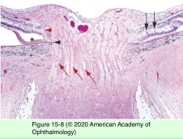
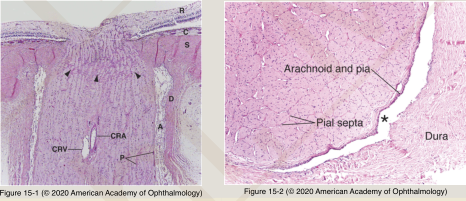
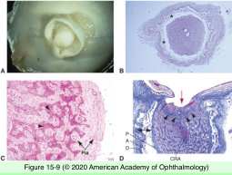
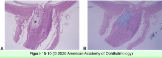
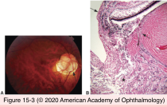
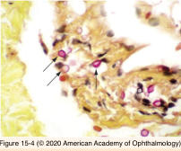
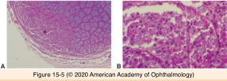
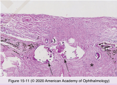
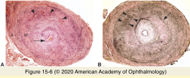

# 4.15.1. Optic Nerve (I)

## Images

## Hierarchy

- Topography
  - embryology
    - from optic stalk
      - continuation of optic tract
  - portions
    - intraocular
      - 0.7-1.0 mm
    - intraorbital
      - 25-30 mm
    - intracanalicular
      - 4-10 mm
    - intracranial
      - 10 mm
  - retinal ganglion cell layer axons
  - myelinated posterior to lamina cribrosa
  - glial cells
    - oligodendrocytes
      - myelin production
    - astrocytes
      - support & nutrition
    - microglial cells
      - phagocytic function
  - meningeal coat
    - dura mater
      - merges with sclera
    - arachnoid layer
      - subarachnoid space
    - pia mater
      - pial vessels extend into the optic nerve
- Optic atrophy
  - types
    - ascending atrophy
      - injury to
        - retinal ganglion cells
        - peripheral optic nerve axons
          - axonal swelling
            - optic disc edema
              - retrograde degeneration of axons
    - descending atrophy
      - optic nerve pathologies in intracranial cavity or orbit
  - histology
    - axonal degeneration
    - loss of oligodendrocytes/myelin
    - proliferation of astrocytes/fibroconnective tissue in pial septa
    - optic nerve shrinks
  - Cavernous optic atrophy of Schnabel
    - large cystic spaces posterior to lamina cribrosa
      - contain mucopolysaccharide material
        - alcian blue stain
    - etiology
      - acute intraocular pressure elevation
      - elderly with arteriosclerotic disease
- Congenital anomalies
  - Coloboma
    - defective closure of embryonic fissure
      - inferonasal
      - associated with colobomas of retina/choroid/ ciliary body/iris
    - atrophic/gliotic retina lines the defect
    - ectatic sclera
    - wall may contain
      - adipose tissue
      - smooth muscle
- Infections
  - origin
    - secondary to infections of adjacent anatomical structures
    - systemic infection
      - immunocompromised patient
  - organism
    - bacterial
    - fungal
      - mucromycosis
        - from sinus infection
      - cryptococcosis
        - from CNS infection
        - multiple foci of necrosis
          - little inflammation
      - coccidiomycosis
        - necrotizing granulomas
    - viral
      - associated with CNS lesions
  - multifactorial with autoimmune and infectious causes
    - multiple sclerosis
      - damaged myelin removed by macrophages
      - astrocytic proliferaton
        - plaque
    - acute disseminated encephalomyelitis
- Optic disc drusen
  - +- dominantly inherited
  - clinical
    - bilateral
    - small crowded discs
    - abnormal vasculature
    - location
      - superficial
        - round
        - refractile, pale yellow/white
      - deep
        - pseudopapilledema
  - etiology
    - otherwise normal eyes
      - most common
    - angioid streaks
    - papillitis
    - optic atrophy
    - chronic glaucoma
    - vascular occlusions
  - pathogenesis
    - abnormal axonal metabolism
      - mitochondrial calcification
  - histology
    - basophilic
    - calcific
    - acellular
    - anterior to lamina, posterior to Bruch membrane
    - contain
      - mucopolysaccharide
      - amino acids
      - DNA/RNA
      - iron
      - calcium
- Noninfectious inflammatory disorders
  - giant cell arteritis
    - granulomatous inflammation
      - multinucleated giant cells
    - occlusion of posterior ciliary vessels
      - liquefactive necrosis
    - temporal artery biopsy
      - skip lesions
      - 2 cm
  - sarcoidosis
    - associated with lesion of
      - retina
      - vitreous
      - uvea
    - optic nerve lesions feature necrosis
