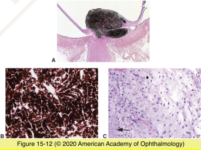
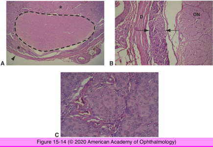
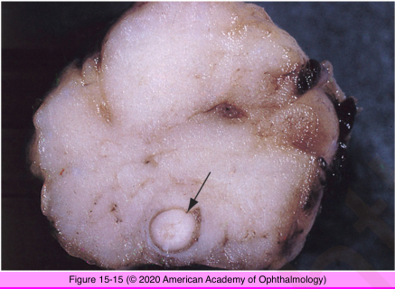
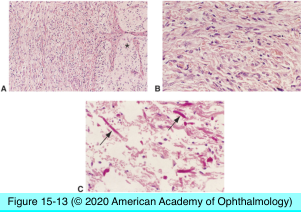

# 4.15.2. Optic Nerve (II): Neoplasia

## Images

## Hierarchy

- from arachnoid sheath
- Melanocytoma
  - clinical
    - deeply pigmented
    - eccentric optic disc location
    - slightly elevated
    - extends into
      - adjacent retina
      - optic nerve
    - +- slow growth
    - rare malignant transformation
  - histology
    - magnocellular nevus
      - plump polyhedral melanocytes
        - bland cytologic features (bleached preparations)
          - abundant cytoplasm
          - small nuclei
          - small nucleoli
      - closely packed
      - maximally pigmented
    - necrosis
    - melanophagic infiltration
      - not indicative of aggressive behavior
- Meningioma
  - primary optic nerve sheath meningioma
    - rare association with neurofibromatosis 1
      - younger age group
    - invade
      - optic nerve
      - eye
      - dura
      - orbit
    - histology
      - meningothelial type
        - plump cells
        - indistinct cytoplamic margins
          - similar to Antoni-A pattern of Schwannoma
            - spindle cells in Schwammoma vs plump cells in meningioma
        - arranged in whorls
        - psammoma bodies
          - round calcifications
          - extracellular
          - surrounded by meningioma cells
          - sparse
  - secondary optic nerve meningioma
    - extension of intracranial meningioma
- Rosenthal fibers
  - enlarged, deeply eosinophilic filaments
- Glioma (astrocytoma, juvenile pilocytic astrocytoma)
  - low-grade glioma
    - 1st decade of life
      - neurofibromatosis 1
    - histology
      - spindle-shaped astrocytes
        - hairlike (pilocytic) cytoplasmic processes
      - +- microcystic degeneration
      - +- calcification
      - thickened pial septae
      - meninges
        - reactive hyperplasia
        - astrocytic infiltration
        - intact dura mater
    - fusiform nerve enlargement
  - high-grade glioma
    - other names
      - grade 4 astrocytoma
      - glioblastoma multiforme
      - malignant glioma
    - rare
    - types
      - primary
        - adults
        - nuclear pleomorphism, high mitotic activity, necrosis, hemorrhage
      - secondary to brain glioma
- more common
