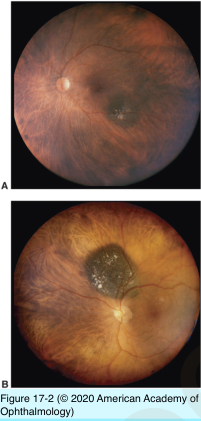
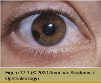

# 4.17.1. Melanocytic Tumors (I): Nevus

## Images

## Hierarchy

- Introduction
  - skin/mucosal melanocytic tumors
    - develop in ectodermal tissue
    - lymphatic spread
  - uveal melanocytic tumors
    - develop in mesodermal tissue
    - hematogenous spread
- Iris nevus
  - clinical
    - pigmented
      - higher incidence in neurofibromatosis
    - slightly raised
    - minimal distortion of iris structure
    - +- slight ectropion irides
    - +- sectoral cataract
    - 2 forms
      - circumscribed
      - diffuse
  - examination
    - slit-lamp biomicroscopy
    - gonioscopy
      - angle involvement
        - rule out ciliary body tumor
  - evaluation of suspicious iris nevi
    - slit-lamp photography
    - ultrasound biomicroscopy
  - management of suspicious iris nevi
    - serial follow-up examinations for growth
- Nevus of ciliary body or choroid
  - demographics
    - choroidal nevi may occur in ≤10% of population
    - ocular/oculodermal melanocytosis (ODM) predisposes to uveal melanoma
      - lifetime risk of uveal melanoma in ODM=1/400
  - usually asymptomatic
    - • visual field defect
  - clinical
    - flat/minimally elevated
    - variable pigmentation
      - some amelanotic
    - indistinct margin
    - overlying RPE disturbance
      - drusen
      - serous retinal detachment
      - choroidal neovascular membrane
      - orange pigment
    - fluorescein angiography
      - hypo- or hyper-fluorescence
  - differential diagnosis of pigmented lesions of ocular fundus
    - choroidal nevus
      - virtually all choroidal melanocytic tumors thinner than 1 mm are nevi
      - flat lesions with basal diameter of ≤10 mm are almost always benign
    - choroidal melanoma
      - risk of malignancy increases with height
        - 1-2 mm in thickness
          - difficult to classify with certainty
            - many may be benign
        - virtually all choroidal melanocytic tumors thicker than 3 mm are melanomas
      - risk of malignancy increases for lesions >10 mm in basal diameter
    - pigmented AMD disciform scar
    - suprachoroidal hemorrhage
    - RPE hyperplasia
    - CHRPE
    - choroidal hemangioma with RPE hyperpigmentation
    - melanocytoma
    - metastatic carcinoma with RPE hyperpigmentation
    - choroidal osteoma
  - Clinical risk factors or enlargement of (small) choroidal melanomcytic lesions
    - symptoms
    - orange pigment
    - subretinal fluid
    - larger tumor size
    - juxtapapillary tumor location
    - absence of drusen or RPE changes
    - hot spots on fluorescein angiography
    - homogeneity on ultrasonography
  - management
    - <1 mm thickness
      - photography
    - .>1 mm thickness
      - photography
      - ultrasonography
    - periodic reassessment for signs of growth
      - definite enlargement
        - suspect malignant change
- Melanocytoma of iris/ciliary body/choroid
  - rare
  - large polyhedral cells
    - small nuclei
    - filled with melanin granules
  - location
    - iris melanocytoma
      - seeding to AC angle
        - glaucoma
    - ciliary body melanocytoma
      - usually not seen clinically
      - extraocular extension
        - darkly pigmented subconjunctival mass
    - simulate choroidal nevus or melanoma
  - may undergo malignant change
    - documented growth
      - treat as a malignancy
