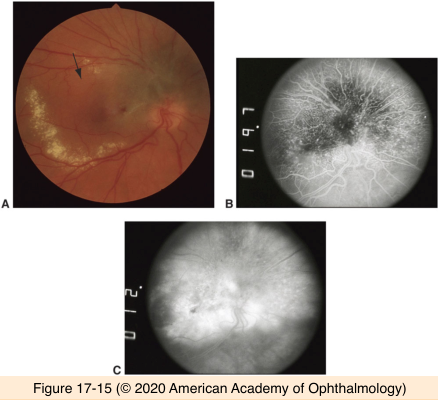

# 4.17.1. Melanocytic Tumors (I): Pigmented epithelial tumors of uvea & retina

## Images

## Hierarchy

- Adenoma/adenocarcinoma
  - ciliary epithelium
    - pigmented
    - nonpigmened
    - indistinguishable from ciliary body melanoma
  - RPE
    - adenoma
      - rare
      - deeply melanotic
      - enlargement
        - rare
      - malignant change
        - seldom
    - adenocarcinoma
      - rare
      - minimal metastatic potential
  - Fuchs adenoma
    - clinical
      - clinically inapparent
      - arise from ciliary crest
      - glistening white
      - irregular
    - histology
      - benign proliferation of nonpigmented ciliary epithelium
      - basement membrane-like material
- Combined hamartoma
  - rare
  - at the disc margin
    - rarely in the periphery
  - darkly pigmented
  - minimally elevated
  - retinal traction
  - tortuous retinal vessels
  - exudative complications
    - hard exudates
- Acquired hyperplasia
  - tissue of origin
    - pigmented ciliary epithelium
      - clinically inapparent
      - may mimic ciliary body melanoma
    - RPE
      - adenomatous hyperplasia
        - my mimic choroidal melanoma
  - etiology
    - trauma
    - inflammation
  - management
    - observation to document stability
