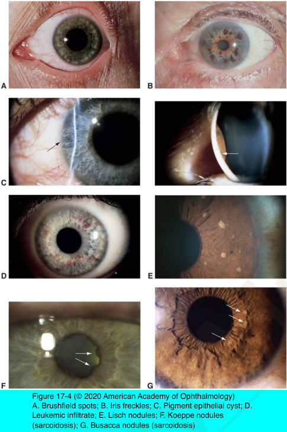
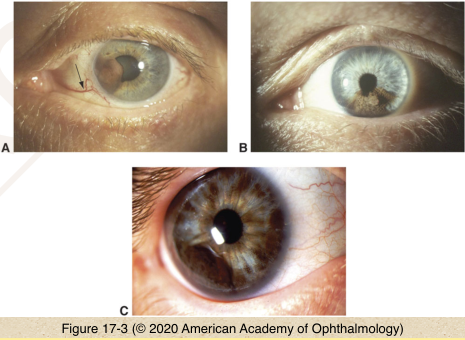
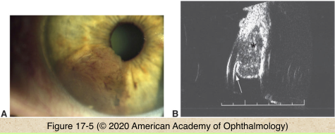

# 4.17.2. Melanocytic Tumors (II): Iris Melanoma

## Images

## Hierarchy

- clinical
  - 3-10% of uveal melanomas
  - amelanotic to dark brown
  - inferior iris
    - 75%
  - growth pattern
    - nodular
    - diffuse
      - rare
      - unilateral acquired hyperchromic heterochromia
      - secondary glaucoma
- differential diagnosis of iris nodules
  - Brushfield spots
    - Down syndrome
      - 85%
    - normal population
      - 25%
    - normal iris stroma surrounded by rim of mild iris hypoplasia
  - epithelial invasion/serous cyst/solid or pearl cyst/implantation membrane
    - following trauma/surgery
  - iris nevus
  - retained foreign body
  - fungal endophthalmitis
    - yellow-white mass
    - +- hypopyon
  - iridocyclitis
    - Koeppe nodules
    - Busacca nodules
    - peripheral anterior synechiae
  - iris freckle
    - increased pigmentation of anterior border layer melanocytes
      - no increased melanocyte number!
  - iris nevus
  - iridocorneal endothelial syndrome (iris nevus syndrome)
  - iris pigment epithelial cyst
  - iris pigment epithelial proliferation
    - black velvety appearance
  - juvenile xanthogranuloma
    - first year of life
    - spontaneous hyphema
    - spontaneous regression
  - leiomyoma
    - lightly pigmented
  - leukemia
    - milky lesions
    - intense hyperemia
    - pseudohypopyon
  - Lisch nodules
    - neurofibromatosis
    - tan to dark brown
    - collections of nevus cells
  - melanocytosis
  - melanoma
  - metastatic carcinoma
  - retinoblastoma
    - +- pseudohypopyon
  - tapioca melanoma
  - iris atrophy
  - retained lens material
- signs suggesting malignancy
  - extensive ectropion iridis
  - prominent vascularity
  - sectoral cataract
  - secondary glaucoma
  - angle seeding
  - progressive growth
  - larger lesion size
  - extrascleral extension
- diagnosis
  - high-frequency ultrasonography
  - fluorescein angiography
    - intrinsic vascularity
    - limited value
  - biopsy
- prognosis
  - low mortality rate
    - 1-4%
    - lower than ciliary body or choroidal melanoma
- treatment
  - excision
  - brachytherapy
  - proton-beam radiotherapy
