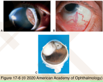
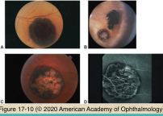
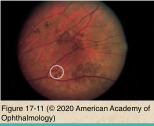
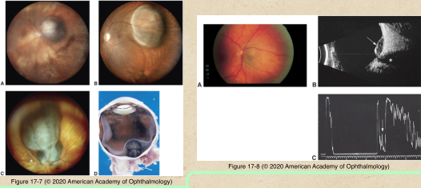
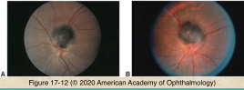
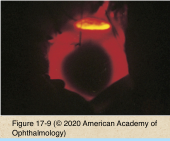
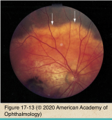

# 4.17.3. Melanocytic Tumors (III): Melanoma of ciliary body or choroid (I)

## Images

## Hierarchy

- Demographics
  - 6-7 cases per million/year
    - most common primary intraocular malignant tumors in adults
  - 50s and early 60s
    - light-colored complexion
  - risk factors
    - ocular/oculodermal melanocytosis
    - genetic predisposition
      - dysplastic nevus syndrome
    - cigarette smoking
- Clinical
  - Ciliary body melanoma
    - asymptomatic in early stages
    - not visible unless pupil is widely dilated
    - erode through iris root
      - anterior chamber invasion
    - extend through sclera
      - extraocular extension
        - dark epibulbar mass
    - dilated episcleral sentinel vessel
    - subluxated lens
    - secondary glaucoma
    - retinal detachment
    - iris neovascularization
    - diffuse growth pattern
      - ring melanoma
  - Choroidal melanoma
    - variable pigmentation
    - shape
      - dome-shaped
      - mushroom-shaped
        - Bruch membrane rupture
    - orange pigment
    - hemorrhage
      - subretinal
      - vitreous
      - mushroom-shaped tumors
    - secondary angle-closure glaucoma
      - anterior displacement of lens-iris diaphragm
      - neovascularization of iris
- Differential diagnosis
  - choroidal nevus
    - no single clinical characteristic is pathognomonic of choroidal melanoma
    - management within ocular oncology centers enhances outcome
  - age-related macular degeneration
    - clinical
      - subretinal neovascularization/fibrosis with variable pigmentation
      - hemorrhage
        - commonly associated with disciform lesions
        - uncommon with melanoma unless tumor extends through Bruch membrane
      - signs of AMD in the other eye
      - involution with serial observation
    - ancillary testing
      - fluorescein angiography
        - virtually pathognomonic
          - early hypofluorescence (blockage by blood)
          - late hyperfluorescence
      - ultrasonography
        - increased heterogeneity
        - lack of intrinsic vascularity
  - Congential hypertrophy of retinal and pigment epithelium
    - solitary
      - flat
      - well-defined
      - 1mm - >10 mm
      - asymptomatic
      - young patient
        - homogeneously black
      - older patient
        - lacunae develop
    - multiple
      - bear tracks
        - grouped pigmentation of the retina
  - melanocytoma
    - dark-brown to black
    - fibrillar margin
    - eccentric location over the optic disc
    - +- elevated
    - peripapillary nevus component
      - 1/3
    - minimal growth
      - 10%/5 year
    - afferent pupillary defect
    - visual field abnormalities
  - suprachoroidal detachment
    - types
      - hemorrhagic
        - dome-shaped
        - multiple quadrants
        - breakthrough vitreous bleeding
      - serous
    - associated with hypotony
      - after ophthalmic surgery
    - ancillary testing
      - ultrasonography
        - absence of intrinsic vascularity
        - evolution of hemorrhage over time
      - MRI with gadolinium
        - in selected cases to document characteristic changes
    - observational management
  - choroidal osteoma
    - juxtapapillary choroid
    - adolescent to young adults
    - F>M
    - +- bilateral
      - 20-25%
    - yellow-orange
    - well-defined margins
    - slow enlargement
    - subretinal neovascularization is a common complication
    - ultrasonography
      - high-amplitude echo
      - loss of orbital echoes behind lesion
    - calcification on CT
- Diagnostic evaluation
  - indirect ophthalmoscopy
    - gold standard
    - if opaque media
      - ultrasonography
      - CT
      - MRI
  - slit lamp biomicroscopy
  - gonioscopy
  - ultrasound biomicroscopy
    - iris/ciliary body tumors
  - ultrasonography
    - most important ancillary tool
    - difficult to differentiate necrotic melanoma from
      - subretinal hematoma
      - metastatic carcinoma
    - A-scan
      - solid tumor pattern
        - high amplitude initial echoes
        - low amplitude internal echoes
          - low internal reflectivity
        - spontaneous vascular pulsations
    - B-scan
      - highly reflective anterior border
      - acoustic hollowness
      - choroidal excavation
      - +- orbial shadowing
  - transillumination
    - ciliary body/anterior choroidal melanomas
      - degree of pigmentation
      - basal diameter
  - fundus photography
    - documenting appearance
    - identifying interval change
  - fluorescein angiography
    - no pathognomonic patterns
  - CT/MRI
    - opaque media
- Classification
  - size
    - tumor volume
    - tumor thickness
    - tumor basal diameter
    - collaborative ocular melanoma study (COMS)
  - staging
    - clinical features
    - pathologic features
    - American joint committee on cancer (AJCC)
