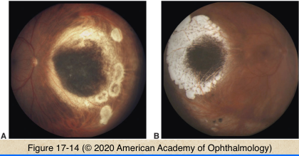

# 4.17.5. Melanocytic Tumors (V): Melanoma of ciliary body or choroid (III): Treatment

## Images

## Hierarchy

- choice of treatment option depends on
  - size, location, extent of tumor
  - visual status of affected & fellow eyes
  - age & general health of patient
- external beam radiation (EBR)
  - types
    - conventional EBR
      - ineffective as single-modality treatment
      - pre-enucleation EBR
        - appears to limit orbital recurrence in large melanomas
        - no statistically significant reduction in 5-year mortality
    - fractionated stereotactic radiotherapy
    - gamma knife radiotherapy
  - cataract surgery after radiation
    - indicated when
      - tumor nonviable
      - visual limitations related to cataract
    - does not increase mortality
- observation
  - to document growth of small melanocytic lesions <1 mm in thickness
  - larger tumors in elderly/systemically ill patients not candidates for therapeutic intervention
- enucleation
  - many large and all extra-large tumors
  - pre-enucleation external-beam radiation does not affect 5-year mortality rate (COMS)
- brachytherapy (radioactive plaque)
  - most common isotopes
    - iodine 125
    - ruthenium 106
  - local tumor control rate
    - ≤95%
  - regrowth
    - 10%
  - radiation complications
    - optic neuropathy
    - retinopathy
    - dose dependent
    - increased rate for tumors close to macula or optic nerve
    - 50%
- alternative treatments
  - photoablation/hyperthermia
    - laser photocoagulation
      - limited role
      - Bruch membrane rupture
    - transpupillary thermotherapy
      - technique
        - large spot size
        - long duration
        - relatively low energy
      - reduction in tumor volume
      - higher rate of local tumor recurrence compared with brachytherapy
  - cyrotherapy
    - triple freeze-thaw
    - small choroidal melanoma
    - not standard treatment
  - transscleral diathermy
    - contraindicated!
      - scleral damage my allow extrascleral tumor extension
  - surgical excision
    - limitations
      - inability to evaluate tumor margins for residual disease
      - high rate of scleral, retinal, vitreous involvement in medium/large tumors
      - difficult surgical technique
    - combined brachytherapy and local excision
  - chemotherapy
    - not effective for primary or metastatic uveal melanoma
  - immunotherapy
    - tumor-directed T-cell activation
      - uses
        - cytokines
        - immunomodulatory agents
        - local vaccine therapy
      - not available for primary uveal melanoma
      - investigational for metastatic disease
  - exenteration
    - traditionally used for extraocular extension of posterior uveal melanoma
    - rarely used today
    - combined enucleation with limited tenonectomy + local radiotherapy
      - gives outcomes similar to exenteration
- charged-particle radiation
  - charged particles
    - protons
    - helium ions
  - mark basal tumor margins with tantalum clips
    - more homogenous radiation dose
  - compared with radioactive plaque
    - less lateral spread
      - Bragg peak effect
    - higher radiation dose to anterior segment structures
  - local tumor control rate ≤98%
  - complications
    - neovascular glaucoma
      - 10%
    - vision loss
      - 50%
