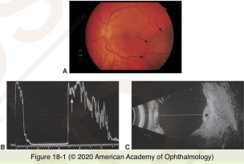
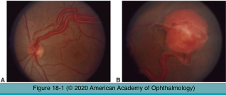
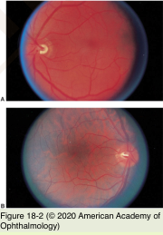
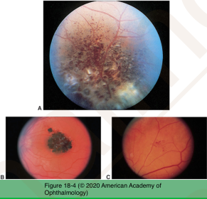
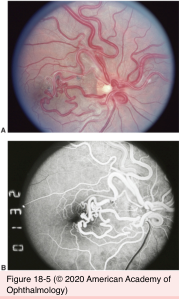

# 4.18.1. Angiomatous Tumors

## Images

## Hierarchy

- Retinal capillary hemangioblastoma
  - 1:40,000
    - autosomal dominant
  - 2nd to 3rd decade of life
  - clinical
    - red-orange
    - large-caliber tortuous afferent & efferent retinal vessels
    - retinal/subretinal exudation
      - predilection for foveal involvement
    - exudative retinal detachment
    - atypical variations
      - optic disc hemangioblastoma
      - free-floating vitreous mass
        - due to vitreous traction
  - fluorescein angiography
    - immediate filling of feeding arteriole
    - rapid arteriovenous transit
    - massive dye leakage
  - systemic association
    - von Hippel disease
      - isolated retinal capillary hemangioblastoma
    - von Hippel-Lindau syndrome
      - chromosome 3
        - genetic consultation
      - systemic findings
        - cerebellar hemangioblastoma
        - renal cell carcinoma
        - pheochromocytoma
      - systemic screening
        - may reduce mortality
  - treatment
    - small lesions
      - laser photocoagulation
    - larger & more peripheral
      - cryotherapy
    - extremely large lesions with extensive retinal detachment
      - scleral buckling + cryotherapy/penetrating diathermy
    - radiation
      - external beam
      - charged-particle
    - PDT
    - VEGF inhibitors
      - reduce macular edema
      - variable impact on size of hemangioma
  - prognosis
    - guarded with large lesions
    - early treatment
      - may improve long-term visual outcome
- Choroidal hemangioma
  - types
    - circumscribed
      - no systemic disorder
      - symptoms
        - blurred vision
        - metamorphopsia
        - micropsia
      - clinical
        - orange-red
        - post-equatorial fundus
        - retinal detachment (serous)
        - cystoid degeneration of outer retina
        - RPE alterations
      - differential diangnosis
        - amelanotic choroidal melanoma
        - choroidal osteoma
        - metastatic carcinoma
        - choroidal granuloma
    - diffuse
      - Sturge-Weber syndrome (encephalotrigeminal angiomatosis)
      - clinical
        - diffuse orange-red thickening of entire fundus
          - tomato ketchup fundus
        - retinal detachment (serous)
        - glaucoma
  - ancillary testing
    - fluorescein angiography
      - prearterial/arterial
        - large choroidal vessels
      - late
        - staining
    - ultrasonography
      - A-scan
        - high-amplitude initial echo
      - B-scan
        - prominent internal reflections (acoustic heterogeneity)
          - high-amplitude broad internal echoes (high internal reflectivity)
        - no choroidal excavation
        - no orbital shadowing
    - CT
      - to differentiate from choroidal osteoma
  - treatment
    - observation
      - asymptomic patients
    - laser photocoagulation
      - unsuccessful with extensive retinal detachment
      - recurrent detachments are common
    - photodynamic therapy (PDT)
      - treatment of choice
      - intravenous verteporfin
        - 6 mg/m2
        - x10 minutes
      - diode laser
        - 689 nm
        - 15 min after starting verteporfin infusion
        - light dose
          - 50-100 J/cm2
        - duration
          - 80-170 seconds
    - radiation
      - brachytherapy
        - circumscribed choroidal hemangioma
      - charged-particle
      - external beam (low dose)
        - diffuse choroidal hemangioma
    - VEGF inhibitors
      - little data available
- Cavernous hemangioma
  - clinical
    - cluster of grapes
    - gliosis/fibrosis on surface of lesion
      - plasma-erythrocyte separation
    - small hemorrhages
    - no exudation
  - extraocular manifestations
    - skin hemangioma
    - CNS hemangioma
      - seizure
  - fluorescein angiography
    - virtually diagnostic
    - very slow filling
      - in contrast to retinal capillary hemangioblastoma!
    - plasma-erythrocyte separation
      - fluorescein on upper part of vascular spaces
    - fluorescein remains in vascular spaces for extended period
    - no leakage
      - in contrast to retinal capillary hemangioblastoma!
  - histology
    - dilated thin-walled channels
    - protrude beneath ILM
    - gliosis
- Arteriovenous malformation
  - Racemose hemangioma
  - artery-to-vein anastomosis
    - no intervening capillary bed
  - tangle of large tortuous blood vessels
  - no fluorescein leakage
  - Wyburn-Mason syndrome
    - AV malformations of
      - midbrain
      - mandible
      - orbit
