# 4.19.1. Retinoblastoma (I)

## Images

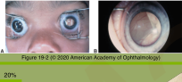

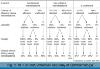

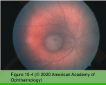

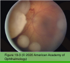

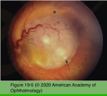

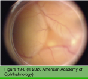

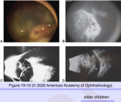

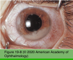

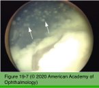

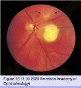

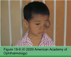

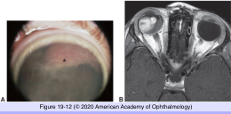

## Hierarchy

- Demographics
  - most common primary intraocular malignant tumor of childhood
  - second most common primary intraocular malignant tumor in all age groups
  - incidence = 1/14,000-1/20,000
    - 3rd most common intraocular cancer overall after melanoma and metastasis
    - 250-300 new cases in US/year
  - M=F
  - R eye = L eye
  - no racial pridilection
  - 90% <3 years of age
  - 30-40% bilateral
  - age at diagnosis
    - (+) family history
      - 4 months
    - bilateral disease
      - 12 months
    - unilateral disease
      - 24 months
  - geographic variation
    - highest incidence in
      - Africa
      - India
    - Mexico>US
    - recent increased incidence in Central America
- Genetic counseling
  - RB1 tumor suppressor gene
    - long arm of chromosome 13 locus 14
      - 13q14
  - mutation of both copies of RB1 gene is needed for tumor formation
  - bilateral RB
    - 98% germline
  - 5% familial
    - germline mutation
  - 95% sporadic
    - 60% unilateral
      - 15% of unilateral cases have germline mutation
        - present at an earlier age
      - no germline mutation
    - 35% multiple/bilateral
      - new germline mutation
  - chance of RB in children of RB survivor with hereditary RB
    - 45%
      - 50% chance of inheriting
      - 90% chance of penetrance
  - genetic testing
    - gene sequencing via quantitative PCR
    - karyotyping
    - fluorescent in situ hybridization
    - multiplex ligation-dependent probe amplification
    - RNA analysis
    - 95% chance of finding a new mutation
    - 15% chance of being germline
  - chance of having an affected child for
    - bilateral (germline) RB survivor
      - 45%
    - unilateral RB survivor
      - 7%
    - normal parents of a child with bilateral RB
      - <5%
    - normal parents of ≥2 siblings with RB
      - 45%
- presenting signs/symptoms
  - leukocoria
    - 60%
  - strabismus
    - 20%
  - ocular inflammation
    - 5%
  - iris heterochromia
  - spontaneous hyphema/hypopyon
  - orbital inflammation/cellulitis
- clinical appearance
  - RB is a clinical diagnosis
  - translucent gray-white intraretinal tumor
  - fed & drained by dilated tortuous retinal vessels
  - calcification
    - chalky white appearance
  - growth pattern
    - exophytic
      - serous retinal detachment
      - subretinal seeds
    - endophytic
      - vitreous seeds
        - may enter anterior chamber
          - iris nodules
          - pseudo-hypopyon
          - secondary glaucoma
          - rubeosis iridis
          - 50%
    - diffuse infiltrating RB
      - unilateral
        - later age (>5 years)
      - dense vitreous cells
      - misdiagnosed as intermediate uveitis
- Differential diagnosis
  - Persistent fetal vasculature (PFV)
    - recognized within days/weeks of birth
    - unilateral
      - 2/3
    - microphthalmos
    - shallow/flat AC
    - hypoplastic iris with prominent vessels
    - retrolenticular fibrovascular mass
      - inward drawing of ciliary processes
    - vascular stalk arising from optic nerve head
      - attached to posterior lens capsule
    - closed funnel retinal detachment
    - short axial length
    - treatment
      - +- calcification
      - combined lensectomy & vitrectomy
        - in selected cases
  - Coats disease
    - 1st decade
    - uilateral
      - M>F
    - yellow exudation
    - no distinct mass
    - exudative retinal detachment
    - neovascular glaucoma
    - ultrasonography
      - no retinal tumor
      - cholesterol convection in subretinal fluid
    - fluorescein angiography
      - telangiectatic vessels
    - treatment
      - laser photocoagulation
      - cryotherapy
      - +- subretinal fluid drainage
  - Ocular toxocariasis
    - older children
    - predisposing factors
      - soil ingestion
      - exposure to puppies
    - clinical
      - posterior granuloma
      - peripheral granuloma
      - uveitis
      - exudative RD
      - cataract
    - ultrasonography
      - no calcium
  - Astrocytoma/Astrocytic hamartoma
    - clinical
      - small smooth white glistening tumor
      - +- mulberry appearance
        - larger
      - located in the nerve fiber layer
        - calcified
      - optic disc astrocytoma
        - giant drusen
      - single or multiple
      - unilateral or bilateral
    - predisposing conditions
      - isolated
        - most common
      - tuberous sclerosis
      - neurofibromatosis
  - Medulloepithelioma
    - derived from inner layer of optic cup (medullary epithelium)
    - benign & malignant forms
    - children aged 4-12 years
      - also in adults
    - arises from
      - ciliary body
        - most common
      - retina
      - optic disc
    - variably pigmented
    - large cysts
    - neovascular glaucoma
      - iris heterochromia
    - +- erode into the anterior chamber
    - treatment
      - observation
      - enucleation
      - iodine 125 plaque radiotherapy
    - metastasis is rare
      - surgical resection
        - specifically avoided
- Diagnostic evaluation
  - examination under anesthesia needed in all patients
    - IOP
    - corneal diameter
    - location of all tumors should be documented
  - examination of parents and siblings
  - complete history & physical examination by pediatric oncologist
  - systemic metastatic evaluation
    - lumbar puncture
    - bone marrow aspiration
    - optic nerve invasion
      - extension into subarachnoid space
    - orbital invasion
      - preceded by massive choroidal invasion
      - proptosis
    - anterior chamber/trabecular meshwork invasion
      - lymphatic spread
        - preauricular lymph nodes
        - cervical lymph nodes
    - metastasis sites
      - skull bones
      - distal bones
      - brain
      - spinal cord
      - lymph nodes
      - abdominal viscera
    - indicated if
      - neurologic abnormalities
      - extraocular extension
        - optic nerve invasion
          - lumbar puncture
  - imaging
    - ultrasonography
      - calcification
    - CT scan
      - calcification
      - potentially harmful radiation exposure
    - MRI
      - preferred diagnostic modality
      - better soft tissue resolution
        - optic nerve
        - orbit
        - brain
