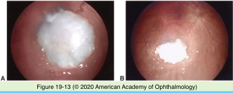
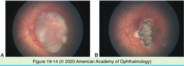

# 4.19.2. Retinoblastoma (II)

## Images

## Hierarchy

- Classification
  - Reese-Ellsworth classification
    - probability of eye preservation after external beam radiation alone
    - groups I-V
    - based on
      - tumor size
      - tumor number
      - tumor location
      - vitreous seeding
    - does not stage extraocular RB
    - does not provide prognostic information about
      - patient survival
      - vision
  - International classification
    - for response to chemotherapy
    - groups A-E
    - based on
      - tumor size
      - subretinal fluid
      - extent of vitreous seeding
      - extent of subretinal seeding
    - unsalvageable (group E)
      - anterior chamber involvement
      - ciliary body involvement
      - neovascular glaucoma
      - vitreous hemorrhage/hyphema
      - phthisis/pre-phthisis
      - orbital cellulitis-like presentation
- Prognosis
  - 95% survival in developed countries
  - risk factors for death
    - extraocular tumor extension
      - scleral invasion
      - optic nerve invastion
        - especially to resected margin
    - choroidal invasion
      - significance of this finding is subject of debate
    - bilateral tumors
      - association with primary intracranial tumors
  - non-ocular malignancies
    - increased incidence in patients with bilateral RB (germline mutation)
      - no exposure to EBR
        - 25% within 50 years
        - 20% within 20 years
        - up to 40% develop third malignancy within 20 years
      - exposure to EBR
        - decreased latency period
        - increased incidence of second cancers
        - increased incidence of second cancers in head & neck
    - latency
      - 9 years (mean)
    - types
      - pinealoma
        - osteogenic sarcoma
          - most common
      - cutaneous melanoma
      - soft tissue sarcomas
      - primitive unclassifiable tumors
    - survival in patients with sarcoma
      - <50%
  - Spontaneous regression
    - histology
      - diagnostic!
      - phthisis
      - vitreous cavity filled with islands of calcified cells embedded in fibroconnective tissue
      - exuberant proliferation of RPE and ciliary epithelia
- Treatment
  - enucleation
    - indications
      - tumor >50% of globe
      - suspected orbital or optic nerve involvement
      - anterior segment involvement
      - neovascular glaucoma
      - limited visual potential
    - obtain the greatest length of optic nerve
      - avoid inadvertent globe penetration
      - .>10 mm
  - chemotherapy
    - drug regimen
      - carboplatin
      - vincristine
      - etoposide
      - cyclosporine
      - every 3-4 weeks x 4-9 cycles
    - reduces tumor volume
    - consolidative focal therapy
      - laser
      - cryotherapy
      - radiotherapy
  - local chemotherapy
    - subconjunctival carboplatin
      - vitreous seeds and retinal tumors respond
      - complications
        - orbital myositis
        - periocular fibrosis
        - optic neuropathy
    - selective canalization of the ophthalmic artery with local chemotherapy
  - photocoagulation
    - green laser
      - 532 nm
    - indications
      - <3 mm in apical height
      - <10 mm in basal dimensions
      - posteriorly located tumors
    - technique
      - 2-3 rows of encircling retinal photocoagulation
      - direct confluent treatment of tumor surface
  - hyperthermia
    - diode laser
      - 810 nm
    - tumor temperature 45-60 degrees celsius
    - direct cytotoxic effect
      - augmented by chemotherapy and radiation
  - cryotherapy
    - indications
      - <3 mm in apical height
      - <10 mm in basal dimensions
      - anteriorly located tumors
    - triple freeze-thaw
  - external beam radiation (EBR)
    - technique
      - focused megavoltage radiation
      - lens-sparing technique
      - 4000-4500 cGy over 4-6 weeks
    - indication
      - bilateral disease not amenable to laser/ cryotherapy
    - result
      - 85% globe salvage rate
      - excellent visual outcome
    - limitations
      - increased risk of second primary malignancies (in patients with germline RB1 mutation)
      - radiation-related sequelae
        - midface hypoplasia
        - cataract
        - optic neuropathy/retinopathy
    - combined modality therapy
      - lower-dose EBR + chemotherapy
        - increased globe conservation
        - decreased radiation morbidity
    - systemic chemotherapy may delay need for EBR
      - decreased risk of orbital hypoplasia
      - decreased risk of second malignancies
      - after age 1 year
  - plaque radiotherapy
    - indications
      - salvage therapy
        - after failure of globe-conserving therapies
      - primary treatment
        - basal diameter<16 mm
        - thickness<8 mm
    - isotopes
      - iodine 125
      - ruthenium 106
        - +- greater likelihood of radiation optic neuropathy/retinopathy
    - compared wtih EBR
      - +- lower incidence of radiation-induced second malignancies
  - targeted therapy
    - gene therapy
      - adenoviral-mediated transfection of tumor cells with thymidine kinase
      - renders tumor susceptible to systemically administered ganciclovir
    - small-molecule inhibition
- Associated conditons
  - Retinocytoma
    - clinically indistinguishable from retinoblastoma
    - developmental biology
      - retinoblastoma that has undergone differentiation
      - benign counterpart of retinoblastoma
    - carries the same genetic implications as retinoblastoma
  - Trilateral retinoblastoma
    - definition
      - bilateral RB + ectopic intracranial RB
    - location
      - pineal gland
        - "pinealoblastoma"
      - parasellar region
    - incidence
      - 5% of children with germline RB1 mutation
      - systemic chemotherapy may decrease incidence of trilateral RB
    - presents months to years after treatment of intraocular RB
    - ectopic intracranial RB is primary, NOT metastatic
      - not associated with metastatic disease elsewhere in the body
      - demonstrate features of differentiation
      - evidence of photoreceptor differentiation in the pineal gland
    - screening
      - all patients with RB should undergo baseline neuroimaging
      - patients with RB1 germline mutation should undergo serial neuroimaging
        - bilateral RB
        - unilateral multifocal RB
        - unilateral RB with positive family history
    - neuroimaging technique
      - MRI with & without contrast
    - median survival
      - 8 months
