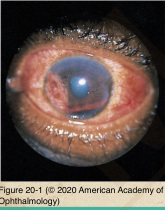
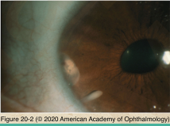
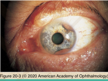
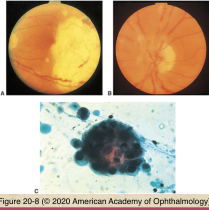
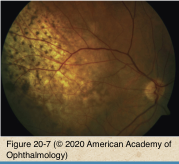
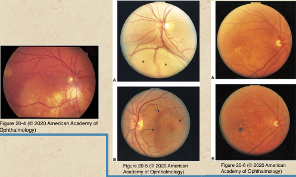

# 4.20.1. Ocular Involvement in Systemic Malignancies: Metastatic Carcinoma

## Images

## Hierarchy

- increasing incidence of intraocular/orbital metastatic tumors
  - the most common intraocular or orbital tumor in adults
  - increasing incidence of certain cancers
  - prolonged survival of patients with certain cancers
  - increasing awareness of medial oncologists/ ophthalmologists
- mechanism
  - hematogenous dissemination
  - posterior choroid has rich vascular supply
    - 10-20X more common than iris or ciliary body
  - optic disc & retina
    - rare
  - bilateral
    - 25%
  - multifocal
    - frequent
  - +- concurrent CNS metastasis
- optic disc metastasis
  - clinical
    - disc edema
    - decreased visual acuity
    - visual field defect
  - ancillary testing
    - ultrasonography
    - MRI
    - parenchyma vs. sheath involvement
- iris & ciliary body
  - clinical findings
    - white or gray-white gelatinous nodules
      - flat
      - ill-defined
    - iridocyclitis
    - secondary glaucoma
    - rubeosis irisdis
    - hyphema
    - irregular pupil
  - examination
    - slit lamp biomicroscopy
    - gonioscopy
    - ultrasound biomicroscopy
- retinal metastasis
  - rare
  - perivascular
  - white, noncohesive
  - vitreous seeding
  - resemble retinitis
- primary tumor sites
  - male
    - Lung (40%)
    - Unkown (30%)
    - GI (10%)
    - Kidney (5%)
    - Prostate (5%)
    - Skin (<5%)
    - Others (<5%)
    - Breast (1%)
  - female
    - Breast (70%)
    - Lung (10%)
    - Unknown (10%)
    - Others (<5%)
    - GI (<5%)
    - Skin (1%)
    - Kidney (<1%)
- prognosis
  - poor
  - survival
    - overall
      - 1-67 months
    - breast cancer
      - 9-13 months
    - metastatic carcinoid
      - long survival
    - shorter survival
      - lung
      - GI
      - GU
- choroid
  - clinical findings
    - loss of vision
    - pain
    - photopsia
    - gray-yellow to yellow-white
    - exudative retinal detachment
    - placoid amelanotic mass
    - multiple/bilateral
      - 25%
    - secondary RPE alterations
      - clumps of brown pigment
        - leopard spotting
    - rapid tumor growth
    - uveitis
    - dilated epibulbar vessels
    - mushroom configuration
      - rare
  - ancillary tests
    - fluorescein angiography
      - helps define tumor margins
      - less useful in differentiating metastasis from primary intraocular tumors
      - does not show
        - double circulation pattern
        - prominent early choroidal filling
          - often seen with choroidal melanoma
    - ultrasonography
      - B-scan
        - echogenic mass
        - ill-defined margins
        - secondary retinal detachment
      - A-scan
        - moderate to high internal reflectivity
    - fine-needle aspiration biopsy
      - when diagnosis cannot be established by noninvasive procedures
      - less differentiated than primary tumor
  - other diagnostic factors
    - history
      - history of prior systemic malignancy
        - 90% for metastasis from breast carcinoma
        - lower for metastasis from lung carcinoma
      - history of smoking
        - metastasis from lung cancer
    - thorough systemic evaluation
      - imaging of breast
      - imaging of chest, abdomen, pelvis
      - PET-CT
- treatment
  - indications
    - decreased vision
    - pain
    - diplopia
    - severe proptosis
    - also consider
      - age
      - health status
      - condition of fellow eye
  - modalities
    - with extraocular metastatic disease
      - chemotherapy
      - hormonal therapy
      - • local eye treatment when vision is endangered
    - no extraocular metastatic disease
      - local eye treatment
        - external-beam radiation
        - brachytherapy
        - laser photocoagulation
        - transpupillary thermotherapy
        - enucleation
          - if severe unrelenting eye pain
        - adverse effects
          - cataract
          - radiation retinopathy
          - radiation optic neuropathy
