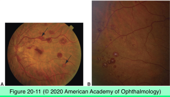
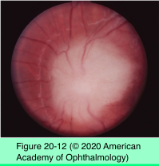

# 4.20.2. Ocular Involvement in Systemic Malignancies (II)

## Images

## Hierarchy

- Direct intraocular extension
  - rare
  - conjunctival squamous cell carcinoma
    - most common
    - aggressive variants
      - mucoepidermoid carcinoma
      - spindle cell variant
  - conjunctival melanoma
  - eyelid basal cell carcinoma
- Ocular manifestations of leukemia
  - ocular involvement at autopsy
    - 80%
  - ocular involvement on clinical exam
    - 40%
  - leukemic retinopathy
    - clinically, retina is the most commonly affected tissue
    - pathogenesis
      - anemia
      - hyperviscosity
      - thrombocytopenia
    - clinical
      - hemorrhages
        - intraretinal
        - subhyaloid
        - white-centered hemorrhages
      - hard exudates
      - cotton-wool spots
      - yellow retinal/subretinal deposits
      - leukemic perivascular infiltrates
        - gray-white streaks in retina
  - vitreous involvement
    - rare
    - diagnostic vitrectomy
  - uveal involvement
    - histologically, uvea is the most commonly affected tissue
    - sanctuary site
      - eye can be the first site of recurrent disease
    - choroidal infiltration
      - difficult to see with ophthalmoscopy
      - diffuse choroidal thickening on ultrasonography
      - serous retinal detachment
    - iris infiltration
      - diffuse iris thickening
      - loss of iris crypts
      - small nodules at pupil margin
      - pseudohypopyon
      - angle involvement
        - secondary glaucoma
  - orbit
    - granulocytic sarcoma/chloroma
    - more common with myelogenous leukemia
    - lateral and medial orbital walls
    - proptosis
  - optic nerve
    - optic disc edema
    - severe vision loss
    - unilateral or bilateral
    - emergency treatment
      - systemic & intrathecal chemotherapy
      - +- radiation
  - treatment
    - low-dose radiation
    - systemic chemotherapy
- Uveal lymphoid infiltration
  - former name
    - reactive lymphoid hyperplasia
  - associated with systemic/visceral/nodal lymphoma
  - clinical
    - 6th decade
    - painless progressive visual loss
    - significant delay in diagnosis
    - can occur at any uveal site
    - amelanotic choroidal thickening
      - diffuse
      - nodular
    - exudative retinal detachment
    - secondary glaucoma
    - +- conjunctival involvement
    - +- orbit involvement
      - proptosis
        - ≤15%
    - ≤85%
  - ultrasonography
    - diffuse homogeneous choroidal infiltrate
    - secondary retinal detachment
    - extraocular/orbital extension
  - pathology
    - biopsy technique
      - extraocular involvement
        - incisional biopsy of conjunctiva/orbit
      - isolated uveal involvement
        - fine-needle aspiration biopsy of uvea
        - pars plana vitrectomy with uveal biopsy
    - localized or diffuse infiltration by lymphoid cells
  - differential diagnosis
    - uveal melanoma
    - metastatic carcinoma
    - sympathetic ophthalmia
    - VKH syndrome
    - posterior scleritis
  - treatment
    - high-dose oral steroid
      - tumor regression
      - decrease exudative retinal detachment
    - low-dose EBR
      - definitive treatment
  - prognosis
    - excellent survival prognosis
      - except patients with systemic lymphoma
    - visual prognosis related to
      - tumor location
      - exudative RD
      - glaucoma
      - early intervention
