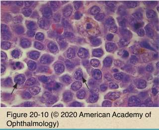
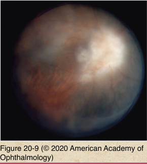

# 4.20.3. Ocular Involvement in Systemic Malignancies (III): Vitreoretinal Lymphoma

## Images

## Hierarchy

- alternate names
  - primary intraocular lymphoma
  - large cell lymphoma
  - retinal lymphoma
- demographics
  - most common lymphoma involving the eye
  - most aggressive lymphoma involving the eye
  - 30% unilateral at presentation
  - 85% become bilateral
  - associated with primary CNS lymphoma (PCNSL)
    - concomitant CNS involvement
      - 60%
    - neurologic deficits
      - 10%
    - increased incidence of PCNSL in recent decades
      - both immunocompetent & immunocompromised patients
- pathology
  - coordinate with pathologist prior to surgery
  - sampling
    - pars plana vitrectomy
      - diluted
      - undiluted
      - a second biopsy may be required
    - aspiration of subretinal (sub-RPE) infiltrates
  - cytologic evaluation
    - essential
    - immunohistochemical studies for cell surface markers
      - cell subclassification
  - flow cytometry
  - PCR/FISH for gene rearrangement
  - IL-10/IL-6 ratio
    - IL-10 levels are elevated with VR lymphoma
    - high vitreous levels of IL-6 are found with inflammatory uveitis
    - elevated IL-10/IL-6 ratio
  - ancillary studies
- clinical findings
  - ocular findings may occur before CNS findings
  - diffuse vitreous cells
  - minimal anterior chamber reaction
  - subretinal/sub-RPE yellow-white infiltrates
    - overlying RPE clumping
    - "headlight in fog"
  - +- retinal vasculitis
  - +- vascular occlusion
  - masquerades as nonspecific uveitis
    - bilateral posterior uveitis after age 50
    - chronic uveitis in 5th-7th decades
      - suggestive of VR lymphoma
- treatment
  - systemic chemotherapy
    - limited intraocular penetration
    - high-dose methotrexate
    - recurrence is common
  - EBR
    - tumor invariably recurs
    - +- with systemic or intrathecal chemotherapy
  - intraocular chemotherapy
    - intravitreal methotrexate
      - good response
      - low recurrence rate
    - intravitreal rituximab
- ancillary testing
  - fundus photography
  - fluorescein angiography
  - ultrasonography
    - discrete nodular or placoid subretinal infiltration
    - retinal detachment
    - vitreous syneresis with increased reflectivity
  - neurologic consultation
  - brain CT/MRI
  - lumbar puncture
  - rarely helfpul in differential diagnosis
- prognosis
  - poor
  - regular follow-up by experienced medical oncologist
  - patients with primary CNS lymphoma need long-term follow-up by ophthalmologist
    - even after remission of CNS disease!
