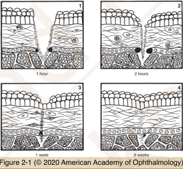
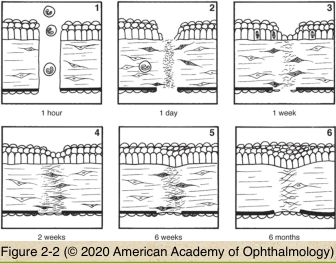

# 4.2.1. Wound Repair

## Images

## Hierarchy

- Eyelid/Orbit
  - Vascular pericytes
    - Myofibroblasts
      - Wound contraction
  - Striated muscles
    - Do not regenerate
    - Undergo hypertrophy
- Phases
  - Acute Inflammation
  - Regeneration/Repair
    - Regeneration
      - Replacement of lost (labile) cells
    - Repair
      - Granulation tissue
  - Contraction
    - Fibrous scar
- Retina
  - Retinal cells do not regenerate
  - Glial cell proliferation —> Glial scar
    - Muller cells
    - Fibrous astrocytes
    - Architectural planes
      - Internal limiting membrane
        - in contrast to
      - Bruch membrane
  - Bruch membrane damage
    - Choroidal fibrovascular proliferation
      - Fibroblasts
        - Not fibroblasts!
    - Retinal pigment epithelial proliferation
      - medscape.org/viewarticle/744738_2
- Vitreous
  - Inflammation
    - Glial/Fibrous proliferation
      - Tractional retinal detachment
    - Vascular proliferation
- Lens
  - Lenticular epithelial cells seal small capsular rents
  - Posterior synechiae make lenticular epithelium anoxic or hypoxic
    - Metaplastic response
      - Fibrous plaques intermixed with basement membrane
- Uvea
  - Iris
    - No healing response
    - Pigment epithelium may be stimulated to migrate in some circumstances
      - Limited to the subjacent surface of the lens capsule
        - Posterior synechiae
  - Ciliary body & choroid
    - thin fibrous scar develops
      - No stromal or melanocytic regeneration
- Corneal healing
  - Corneal epithelium
    - Starts in 1 hour
      - Parabasilar epithelial cells
        - Slide
        - Divide
    - Defect covered in 24-48 hours
    - Complete healing takes 4-6 weeks
      - Reformation of anchoring fibrils
      - Normal epithelial thickness
        - 4-6 layers
  - Corneal stroma
    - Avascular healing
    - Tear film
      - Neutrophils
      - Lysozymes
    - Epithelial healing
      - Growth factors
        - Stimulate and sustain healing
          - collagen type III
            - collagen type I
    - Bowman membrane does not regenerate
    - Stromal fibroblasts become activated and migrate
      - Collagen
        - Replaced by stronger collagen later
      - Fibronectin
  - Endothelial healing
    - Migration (& mitosis)
    - New Descemet membrane
- Direction of fibroblasts and collagen is not parallel to stromal lamellae
  - Corneal opacity
- Collector channels do not contribute
- Limbal healing
  - Vascular ingrowth from episclara
    - in contrast to clear corneal wound repair
- No surface epithelial remodelling
- Scleral healing
  - Episclera
  - Uvea
