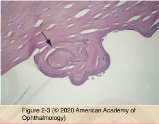
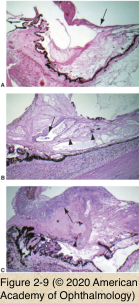
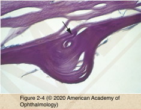
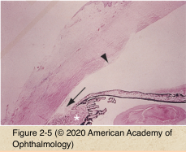
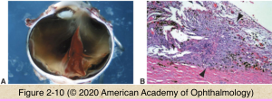
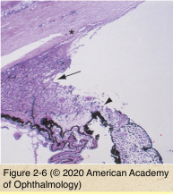
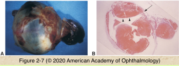
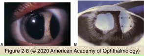
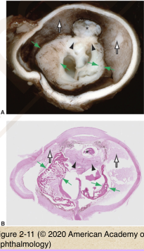

# 4.2.2. Histologic Sequelae of Ocular Trauma

## Images

## Hierarchy

- Rupture of the Descemet membrane
  - keratoconus
  - forceps trauma
- Fibrocellular proliferation
  - Penetrating trauma
    - Tractional retinal detachment
    - Hemorrhage
      - Hemosiderin at 72 hours
      - Sequelae
        - Siderosis bulbi
        - Cholesterolosis
        - Hemoglobin spherulosis
    - Proliferative vitreoretinopathy
    - Hypotony & phthisis bulbi
- Cyclodialysis
  - Disinsertion of longitudinal muscle of ciliary body from scleral spur
  - Hypotony
    - Increased aqueous drainage
    - Decreased aqueous production
- Bruch membrane/choroidal rupture
  - Direct/Indirect trauma
  - Sequelae
    - Choroidal neovascularization
    - Granulation tissue proliferation
    - Focal post-traumatic choroidal granulomatous inflammation
      - After projectile injury
    - Sclopetaria
      - Chorioretinal rupture & necrosis
- Anterior chamber angle recession
  - Tear between longitudinal and circular muscles of ciliary body
  - Posterior displacement of the iris root
  - Concurrent damage to the trabecular meshwork
- Attachments between uvea and sclera
  - 1. Scleral spur
  - 2. Ostia of vortex veins
  - 3. Peripapillary area
  - Borders of a dome-shaped choroidal hemorrhage are defined by the position of vortex veins and scleral spur
- Phthisis bulbi
  - Atrophia bulbia without shrinkage
    - Loss of nutrition
      - Cataract
      - Serous retinal detachment
      - Anterior/Posterior synechiae
        - High intraocular pressure
  - Atrophia bulbia with shrinkage
    - Ciliary body dysfunction
      - Low intraocular pressure
        - Small, squared-off eyeball
      - Corneal edema/scarring/vascularization
  - Phthisis bulbi
    - 16-19 mm eyeball
    - Disorganized intraocular structures
    - Retinal pigment epithelial proliferation/Drusen
    - Osseous metaplasia of retinal pigment epithelium
      - Retina
    - Scleral thickening
    - Calcification
      - Bowman layer
      - Lens
      - Drusen
- Iridodialysis
  - Tear at iris base
- Iris sphincter rupture
  - Notch at pupillary margin
- Vossius ring
  - Iris pigment epithelial damage
    - Ring of pigment on anterior lens surface
- Lens damage
  - Cataract
    - Lens capsule thinnest at posterior pole
  - Anterior lenticular fibrous plaque
  - Zonular rupture
    - Subluxation/Dislocation of lens
    - Vitreous prolapse into anterior chamber
- Commotio retinae
  - Blunt trauma
    - Disruption in architecture of photoreceptors
- Retinal dialysis
  - Blunt trauma
    - Tear at:
      - Ora
      - Posterior margin of vitreous base
      - Circumferential location
        - Inferotemporal
        - Superonasal
