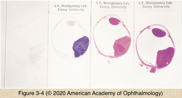
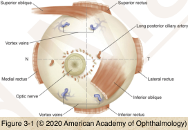
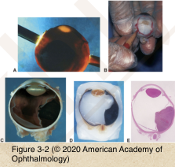
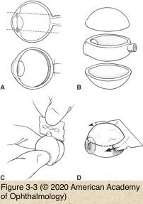

# 4.3.1. Specimen Handling

## Images

## Hierarchy

- Communication with pathologist
  - Pathology request form
    - Relevant and detailed clinical history
      - Patient age
  - Direct communication
  - Review previous biopsies
- Globe orientation
  - Rectus muscle distance from limbus
    - MR<IR<LR<SR
  - Inferior oblique muscle
    - Right vs left eye
- Transillumination
  - Intraocular tumors
- Stains
  - H&E
    - Nucleus: Blue; Cytoplasm: Red
    - General stain
  - PAS
    - Glycogen and proteoglycans: Magenta
    - Basement membranes
      - Descemet membrane
    - Mucin in goblet cells
    - Fungi
    - Acanthamoeba keratitis
    - PXF material
    - Drusen
    - Fundus flavimaculatus/Stargardt disease
  - Alcian blue
    - Acid mucopolysaccharide: Blue
      - Macular dystrophy
    - Cavernous optic atrophy
    - Asteroid hyalosis
  - Colloidal iron
    - Acid mucopolysaccharide: Blue
      - Macular dystrophy
  - Congo red
    - Amyloid: Orange; Red-green dichroism; birefringence
      - Lattice dystrophy
  - Crystal violet
    - Amyloid: Purple, violet
      - Lattice dystrophy
  - Thioflavin T
    - Amyloid: Fluorescent yellow
      - Lattice dystrophy
  - Masson trichrome
    - Collagen: Blue
    - Hyaline: Bright red
      - Granular dystrophy
  - Alizarin red
    - Calcium: Red
      - Band keratopathy
  - von Kossa
    - Calcium phosphate salts: Black
      - Band keratopathy
  - Gram stain
    - Gram positive bacteria: Blue; Gram negative bacteria: Red
    - Bacterial infection
  - Ziehl-Neelsen
    - Acid-fast organisms: Red
    - Atypical mycobacteria
  - GMS
    - Fungal elements: Black
    - Fusarium
  - Perls Prussian blue
    - Iron: Blue
    - Hemosiderosis bulbi
  - Verhoeff-van Gieson
    - Elastic fibers: Black
    - Temporal artery elastic layer
    - Elastotic degeneration of stromal collagen
  - Giemsa
    - intranuclear viral inclusions
  - Calcoflour white
  - Acridine blue
    - Acanthamoeba
- Gross dissection
  - 2 calottes are removed
  - Pupil-Optic nerve (PO) Section
    - No prior surgery/trauma or intraocular tumor
      - Horizontal PO section
        - Includes macula
    - Prior surgery/Trauma
      - PO section perpendicular to wound
        - Vertical cut
    - Intraocular tumor
      - PO section through the center of the tumor
- Fixatives
  - Fixatives
    - Formalin
      - Clear
      - Routine fixation of all tissues
    - Bouin solution
      - Yellow
      - Small biopsies
    - B5
      - Clear
      - Lymphoproliferative tissue
    - Glutaraldehyde
      - Clear
      - Electron microscopy
    - Ethanol/Methanol
      - Clear
      - Crystals
    - Michel fixative
      - Light pink
      - Immunofluorescence
    - Zenker acetic fixative
      - Orange
      - Muscle differentiation
  - 4-6 micron sections
