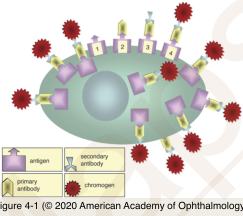
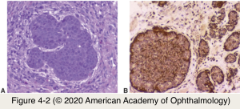
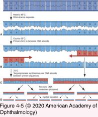
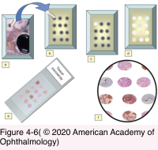
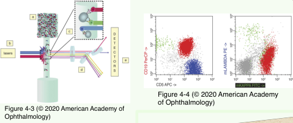

# 4.4.1. Special Procedures

## Images

## Hierarchy

- Immunohistochemistry
  - Components
    - Cell antigen
      - Cytokeratin
        - Epithelial cells
          - Adenoma
          - Carcinoma
      - Desmin, Myoglobin, Actin
        - Smooth/Skeletal muscle
          - Leiomyoma
          - Rhabdomyosarcoma
      - S-100 protein
        - Neuroectodermal origin
          - Schwannoma
          - Neurofibroma
          - Melanoma
      - HMB-45, Melan-A
        - Melanocytic lesions
          - Nevus
          - Melanoma
      - Chromogranin, Synaptophysin
        - Neuroendocrine
          - Carcinoid
          - Small cell carcinoma
      - Leukocyte common antigen
        - Hematopoietic cells
          - Leukemia
          - Lymphoma
      - CD antigens
        - White blood cells
      - Her2Neu, c-Kit
        - Prognosis & treatment
          - Breast carcinoma
          - Mastocytosis
    - Primary antibody
    - Secondary antibody
    - Chromogen/Enzyme
      - Brown
      - Red
        - Especially helpful in working with ocular pigmented tissues and melanomas
  - Types
    - Direct
    - Indirect
      - More sensitive than direct method
- Molecular Pathology
  - To detect
    - Tumor-promoting genes
    - Tumor-inhibitor genes
    - Viral DNA
    - Viral RNA
  - Clinical uses
    - Leukemias
    - Lymphomas
    - Soft tissue tumors
      - Rhabdomyosarcomas
      - Neuroblastomas
      - Peripheral neuroectodermal tumors
    - Tumors with nondiagnostic histopathology
  - Polymerase Chain Reaction
    - Amplifies a single strand of nucleic acid
    - Provides supplementary information
    - Steps
      - Heat sample to 95C
        - DNA strands separate
      - Cool sample to 55C
        - Primers bind to template strands
      - Heat sample to 72C
        - Taq DNA polymerase synthesizes new DNA strands
      - Cycle is repeated
    - Components
      - Primers
        - Short DNA fragments complimentary to the target region
      - DNA polymerase
      - Nucleotides
    - Multiplex ligation-dependent probe amplification
      - Multiple targets amplified simultaneously with a single primer pair
  - Microarray
    - To survey the expression of thousands of genes in a single assay
      - Gene expression profiling
  - Steps & components
    - Chip
      - Glass slide
    - Probes
      - DNA fragments (Oligonucleotides)
    - Target
      - Fluorescent or chemiluminescent labeled purified cDNA or cRNA
        - Hybridized to the "arrayed" chip
    - Laser scanning
- Flow Cytometry
  - Immunophenotyping of hematopoietic proliferations (Lymphomas)
  - Fresh tissue
  - Shows percentage of specific cells (e.g. CD4+ lymphocytes)
  - Components
    - Antigens on surface of lymphoid cells
    - Fluorochrome-labeled specific antibodies
    - Light source (Argon laser)
    - Photodetector
- Fine-Needle Aspiration Biopsy
  - Cytopathology
    - Uveal melanoma vs uveal metastasis
    - Intraocular lymphoma
    - Orbital tumors
  - Cytogenetics
    - Monosomy of chromosone 3 in uveal melanoma
      - High risk of metastasis
      - Microsatellite assay
  - No significant risk of tumor seeding
    - Except retinoblastoma!
  - Techniques
    - Liquid-based preperation (Cytospin)
    - Cell block
      - Allows performance of special stains, etc
- Frozen Section
  - Only when results affect management of patient in operating room
    - Are margins free to tumor?
      - Lid tumors
    - Is sample representative?
    - Do not proceed with surgery before receiving result of frozen section
  - Techniques
    - Routine frozen section
    - Mohs micrographic surgery
- Electron microscopy
  - To determine cell of origin of a tumor of questionable differentiation
