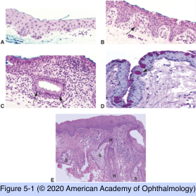
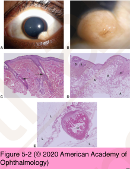
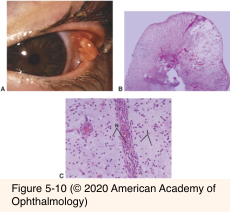

# 4.5.1. Conjunctiva (I)

## Images

## Hierarchy

- Topography
  - Regions
    - Bulbar
    - Forniceal
    - Palpebral
      - Epithelial ridges
    - Caruncular
      - Contains
        - Sebaceous glands
        - Hair follicles
  - Tissues
    - Epithelium
      - Non-keratinized stratified squamous
      - Goblet cells
        - Most numerous in
          - Fornix
            - Pseudoglands of Henle
              - Infoldings of conjunctiva with abundant goblet cells
          - Plica
    - Stroma
      - Substantia propria
        - General
          - Thickest in fornix
          - Thinnest over tarsus
          - Fuses with Tenon capsule in bulbar region
        - Constituents
          - Collagen fibers
          - Vessels, lymphatics, nerves
          - Accessory lacrimal glands
          - Lymphocytes
            - Lymphoid follicles
              - Conjunctiva-associated lymphoid tissue
          - Plasma cells, macrophages, mast cells
- Congenital anomalies
  - Choristomas
    - Normal mature tissue in abnormal location
    - Types
      - Limbal dermoid
        - Firm
        - Dome-shaped
        - White-yellow
        - Variable size
        - Dermal adnexal structures
        - Epithelium
          - +- Keratinized
        - Location
          - Limbus
            - Inferotemporal
          - Central cornea
        - Types
          - Isolated
          - Syndromic
            - Bilateral
            - Goldenhar syndrome (oculoauriculovertbebral dysgenesis)
              - Epibulbar dermoid
              - Upper lid coloboma
              - Preauricular skin tags
              - Vertebral anomalies
            - Linear nevus sebaceous syndrome
      - Lipodermoid
        - Softer & yellower than limbal dermoid
        - Fornix
        - Superotemporal
        - +- Orbital extension
        - +- Dermal adnexal structures
        - +- Goldenhar or linear nevus sebaceous syndromes
      - Ectopic lacrimal gland
      - Episcleral osseous (osseocartilaginous) choristoma
        - Contains bone
      - Complex
        - Multiple types of choristomas
  - Normal mature tissue overgrowth in normal location
  - Hamartomas
    - Congenital
    - Capillary hemangioma
- Pyogenic granuloma
  - Reddish pedunculated nodule
  - Predisposing conditions
    - Chalazion
    - Trauma
    - Surgery
  - Histology
    - Granulation tissue
      - Acute & chronic inflammatory cells
      - Proliferating capillaries
        - Spoke-wheel pattern
