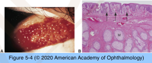
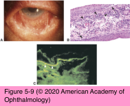
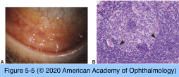
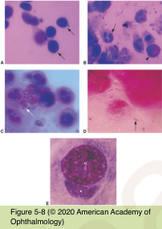
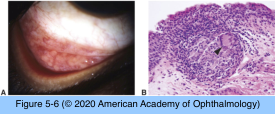
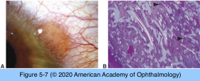
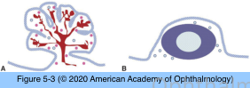

# 4.5.2. Conjunctiva (II): Conjunctivitis

## Images

## Hierarchy

- Non-Infectious Conjunctivitis
  - Types
    - Most cases of papillary conjunctivitis
    - Some granulomatous conjunctivitis
    - Toxic follicular conjunctivitis
  - Ocular cicatricial pemphigoid
    - Autoimmune
    - Other mucous membranes
    - ± Skin involvement
    - Conjunctival biopsy
      - Submit half in formalin
        - Routine histology
          - Epithelial bullae
          - Subepithelial band of chronic inflammatory cells (plasma cells)
      - Submit half in Michel medium or saline
        - Immunofluorescence analysis
          - Epithelial basement membrane
          - Immunoglobulins
            - IgG
            - IgM
            - IgA
          - Complement
            - C3
          - Sensitivity = 50%
            - Negative result does not rule out OCP!
- Inflammations
  - Papillary Conjunctivitis
    - Closely packed flat-topped projections
      - Red on surface, pale at base
      - Upper tarsal conjunctiva
        - Giant papillary conjunctivitis
      - Histology
        - Epitheilum
        - Central vascular core
        - Stroma
          - Eosinophils
          - Lymphocytes
          - Plasma cells
          - Mast cells
    - Etiology
      - Allergic immune response
        - Vernal conjunctivitis
          - Limbal papillae
            - Horner-Trantas dots
        - Atopic keratoconjunctivitis
      - Foreign body
        - Contact lens
        - Prosthesis
  - Follicular conjunctivitis
    - Small dome-shaped nodules
      - Pale on surface, red at base
      - Lower forniceal and palpebral conjunctiva
      - Histology
        - Lymphoid follicle
          - Germinal center
            - Immature proliferating lymphocytes
          - Corona
            - Mature lymphocytes and plasma cells
    - Etiology
      - Viruses
      - Atypical bacteria
      - Toxins
        - Brimonidine
        - Ophthalmic decongestants
  - Granulomatous conjunctivitis
    - Etiology
      - Infectious
        - Parinaud oculoglandular syndrome
          - Granulomatous conjunctivitis + preauricular lymphadenopathy
        - Bacteria
          - Bartonella henselae (cat-scratch disease)
          - Francisella tularensis (tularemia)
          - Mycobacteria (tuberculosis)
          - Treponemes (syphylis)
        - Diagnosis
          - Serology
          - Culture
          - PCR
        - Histology
          - Central necrosis
            - "Caseation"
            - Infectious granulomatous conjunctivitis
          - Bacteria
      - Non-infectious
        - Sarcoidosis
          - Clinical
            - Small tan nodules
              - Forniceal conjunctiva
            - Non-injected asymptomatic eye
          - Histology
            - Noncaseating granulomatous tubercles
              - No central necrosis
              - Aggregates of epithelioid histiocytes
              - +- Multinucleated giant cells
              - Cuff of lymphocytes and plasma cells
        - Foreign body granuloma
          - Multinucleated giant cells
          - Polarized light
- Infectious Conjunctivitis
  - Most common pathogens
    - Children
      - H. influenzae
      - S. pneumoniae
    - Adults
      - Viral
        - Adenovirus
          - Corneal subepithelial infiltrates
        - Herpes viruses
          - Corneal ulcer
  - Pathogens
    - Chlamydiae
      - Obligate intracellular pathogens
      - Follicular conjunctivitis
      - C. trachomatis
        - Serotypes A, B, C
          - Trachoma
        - Serotypes D-K
          - Adult & neonatal inclusion conjunctivitis
      - Diagnosis
        - Exfoliative cytology
        - Tissue biopsy
        - Intracellular organisms
    - Fungi
      - Typically involve the cornea
    - Microsporidia
      - Obligate intracellular parasites
      - Keratoconjunctivitis
      - AIDS
    - Rhinosporidium seeberi
      - Protozoon
      - India, Southeast Asia
      - Exposure to stagnant water
      - Isolated conjunctivitis
        - Palpebral/forniceal conjunctivitis
    - Acanthamoeba
      - Protozoon
      - Keratoconjunctivitis
      - Isolated chronic unilateral conjunctivitis
      - Exfoliative cytology
