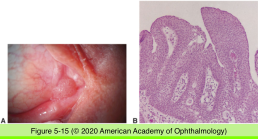
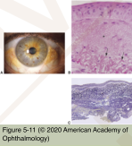
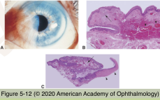
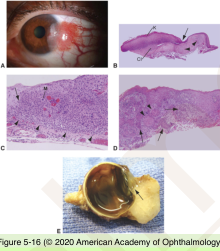
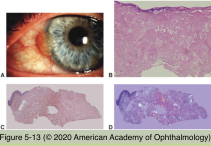
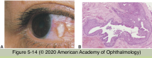
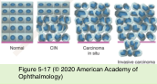

# 4.5.3. Conjunctiva (III)

## Images

## Hierarchy

- Degenerations
  - Pinguecula
    - small yellowish nodule
    - bilateral
    - asymptomatic
    - actinic damage
    - histology
      - elastotic degeneration of stromal collagen
        - Verhoeff-van Gieson staining
          - fragmenation
          - basophilic degeneration
  - Pterygium
    - encroaches on cornea
    - histology
      - elastotic degeneration of stromal collagen
      - vascularity
      - chronic inflammation
      - overlying epithelium
        - squamous metaplasia
          - loss of goblet cells
          - surface keratinization
          - malignant transformation to squamous neoplasia
            - rare
        - abnormal ki-67
        - abnormal expression of tumor suppresson genes
          - p-53
          - p-63
      - recurrent pterygium
        - exuberant fibroconnective tissue
  - Amyloid deposits
    - types
      - primary
        - localized
        - healthy
        - young to middle-aged
      - secondary
        - chronic inflammation
          - trachoma
        - multiple myeloma
    - conjunctival nodule
      - salmon-colored
    - histology
      - extracellular eosinophylic material in stroma
        - perivascular distribution
      - stains
        - congo red
          - standard light
            - orange
          - polarized light + rotating polarization filter
            - birefringence with dichroism
              - orange to apple green
        - crystal violet
        - thioflavin T
          - fluorescent yellow
      - local orbital amyloidosis
        - clonal proliferation of plasma cells
          - monoclonal immunoglobulins
            - immunoglobulin-derived amyloid protein
    - electron microscopy
      - characterisitic fibrils
  - Epithelial inclusion cyst
    - accidental or sugical trauma
    - transparent cyst
    - +- injection
    - histology
      - conjunctival epithelial lining
      - +- proteinaceous material/cellular debris
- Neoplasia
  - Squamous papilloma
    - pedunculated
      - pink-red
      - strawberry-like
      - children
      - HPV subtypes 6 and 11
      - histology
        - finger-like projections
          - papillary fibrovascular core
          - stroma
            - chronic inflammatory infiltrate
          - hyperplastic squamous epithelium
            - +- goblet cells
            - +- surface keratinization
            - +- neutrophils
      - +- spontaneous involution
      - excisional biopsy
        - symptomatic
        - cosmetically unacceptable
        - uncertain diagnosis
    - sessile
      - adults
      - bulbar conjunctiva/limbus
      - HPV subtypes 16 and 18
        - same subtypes associated with OSSN
          - premalignant?
      - clinical signs suggestive of malignancy
        - leukoplakia
        - inflammation
      - histology
        - broad base
        - lack finger-like projections
        - hyperplastic epithelium
        - features suggestive of OSSN
          - nuclear hyperchromasia and pleomorphism
          - altered cell polarity
          - many mitotic figures
  - Ocular surface squamous neoplasia (OSSN)
    - risk factors
      - UV exposure
        - higher incidence close to equator
        - mutation in p53 suppressor gene
      - light skin color
      - xeroderma pigmentosa
      - immunosuppression
        - HIV
          - <50 years old
      - older age
      - smoking
      - HPV subtypes 16 and 18
    - clinical findings
      - epithelial thickening
        - gelatinous
        - leukoplakic
          - not pathognomonic
        - corkscrew intrinsic vessels
      - near or at limbus
        - over pinguecula
      - feeder vessels
    - histology
      - epithelial hyperplasia
        - loss of goblet cells
        - loss of cell polarity
        - nuclear hyperchromasia and pleomorphism
        - mitosis
        - +- surface keratinization
        - +- dyskeratosis
      - grading
        - based on cellular atypia
          - mild
          - moderate
          - severe
            - squamous eddies
            - keratin whorls/pearls
      - progression
        - conjunctival intraepithelial neoplasia (CIN)
          - partial thickness epithelial involvement
        - carcinoma in-situ
          - full thickness epithelial involvement
        - invasive squamous cell carcinoma
          - invasion through basement membrane into stroma
          - invasion into the sclera/cornea
          - intraocular invasion
            - rare
              - via surgical wound
              - immunosuppressed patients
              - ozone depleted areas
      - other variants
        - mucoepidermoid carcinoma
        - spindle cell carcinoma
        - rare
          - more aggressive
      - specimen submission
        - place on filter paper
        - allow to dry x 30 sec
    - treatment
      - excisional biopsy
        - cryotherapy to the margins
      - topical agents
        - interferon alpha-2b
        - 5-fluorouracil
        - mitomycin c
