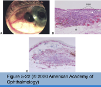
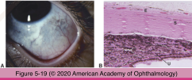
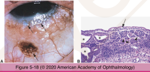
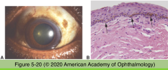
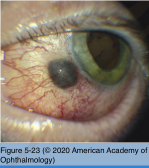
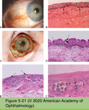

# 4.5.4. Conjunctiva (IV): Melanocytic Lesions

## Images

## Hierarchy

- conjunctival nevi
  - demographics
    - children
  - clinical features
    - bulbar conjunctiva
      - beware of pigmented conjunctival lesions involving palpebral conjunctiva
    - +- pigmentation
      - become more pigmented at puberty
  - histology
    - nested pattern of melanocytes
    - epithelial inclusion cysts
    - phases
      - junctional
        - interface between epithelium and substantia propria
        - nests (theques)
      - descend into substantia propria
    - histologic types
      - junctional
        - only at the epithelial-stromal junction
      - compound
        - both junctional & subepithelial
        - epithelial inclusion cysts
      - subepithelial/stromal
        - only in the substantia propria
    - clinical variants
      - blue nevus
        - blue-gray to blue-black
        - melanocytes in deep stroma
        - spindly morphology
          - similar to uveal nevi
        - ocular melanocytosis is a form of blue nevus
        - ocular/dermal melanocytosis
          - unilateral
          - darkly pigmented individuals
          - deep episclera/sclera
            - slate-gray color
            - ocular melanocytosis
          - uveal tract
            - iris hyperchromia
            - choroidal hyperchromia
          - periocular skin
            - dermal melanocytosis
            - oculodermal melanocytosis/Nevus of Ota
          - +- orbital melanocytosis
          - GNAQ mutation
          - malignant transformation into melanoma
            - usually uveal melanoma
          - secondary glaucoma
- Melanoma
  - predisposing lesions
    - PAM
      - 50-70%
    - nevus
      - 20%
    - de novo
      - 10%
        - melanomas arising de novo
  - clinical features
    - nodular growth
    - intrinsic vascularity
    - pigmentation
      - melanotic
      - amelanotic
        - even from pigmented PAM
  - histology
    - spindle to epithelioid cell morphology
    - +- mitosis
  - lymphatic spread
    - preauricular, submandibular, cervical lymph nodes
    - lung, liver, brain, bone, skin
  - unfavorable prognostic features
    - non-epibulbar location
    - greater tumor thickness
    - scleral invasion
    - positive lateral margin
    - poor prognostic indicators
      - not involving the limbus
        - location in the palpebral conjunctiva, caruncle, or fornix
      - involvement of the eyelid margin
      - thickness >1.8 mm
      - invasion into deeper tissues
      - residual involvement at the surgical margins
      - pagetoid or full-thickness intraepithelial spread
      - lymphatic invasion
      - mixed cell type
  - treatment
    - excision
  - mortality
    - 15-30%
  - differential diagnosis
    - extraocular extension of ciliary body melanoma
      - sub-conjunctival
      - no adjacent PAM
    - metastatic cutaneous melanoma
- Intraepithelial melanosis
  - Benign acquired melanosis (BAM)
    - bilateral
    - young adults
    - darkly pigmented individuals
    - involved areas
      - bulbar conjunctiva
      - limbus
      - cornea
        - striate melanokeratosis
      - caruncle
      - palpebral conjunctiva
    - histology
      - proliferation of benign melanocytes along the basal epithelial layer
  - Primary acquired melanosis (PAM)
    - unilateral
    - middle-aged adults
    - lightly pigmented individuals
    - • slowly enlarge
    - • transformation into melanoma
    - management
      - <1 clock hour
        - observe
      - .>3 clock hours
        - excise
      - caruncle, fornix, palpebral conjunctiva
        - excise
      - extensive disease
        - consider mitomycin-C
    - classification
      - PAM without atypia
        - similar to BAM
          - no cellular atypia
          - limited to basal epithelial layer
          - no risk of malignant transformation
      - PAM with aypia
        - migrates into more superficial epithelium
          - pagetoid spread
          - full-thickness epithelial involvement
            - melanoma in-situ
        - discohesiveness
        - epithelioid cells
          - hyperchromatic nuclei
          - prominent nucleoli
        - • mitosis
        - • chronic inflammation
