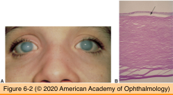
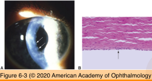
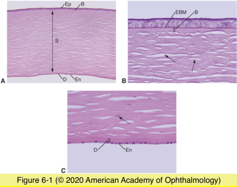
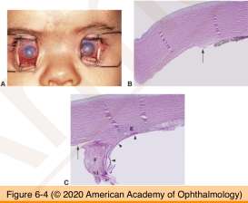

# 4.6.1. Cornea (I)

## Images

## Hierarchy

- 43.25 D
- Corneal anatomy
  - epithelium
    - nonkeratinized
    - stratified squamous
      - 5-10 cell layers
        - 5-10% of corneal thickness
    - basement membrane
      - PAS-positve
      - gets thicker in anterior basement dystrophy
  - Bowman layer
    - not true basement membrane
    - acellular
    - irregularly arranged collagen fibrils
    - does not regenerate afer injury
      - fibroconnective scar tissue
  - stroma
    - 90% of corneal thickness
    - keratocytes
    - collagen lamellae
      - regularly arranged
    - proteoglycan ground substance
  - descemet membrane
    - deposition starts during fetal development
      - continues throughout adulthood
    - type IV collagen
    - PAS-positive
  - endothelium
    - single layer
    - hexagonal
    - number of cells decreases with age
    - does not regenerate
- Congenital anomalies
  - Congenital hereditary endothelial dystrophy (CHED)
    - degeneration of endothelial cells after fifth month of gestation
    - CHED1
      - autosomal dominant
        - 20p11.2-q11.2
      - apparent within the first few years of life
      - progressive
      - no nystagmus
    - CHED2
      - autosomal recessive
        - 20p13
      - more common
      - apparent at birth
      - non-progressive
      - nystagmus
    - pathology
      - endothelial cell loss
      - diffuse stromal edema
      - thick descemet membrane
        - no guttae
    - no systemic associations
  - Posterior polymorphous dystrophy
    - autosomal dominant or recessive
      - 20q11
    - endothelial dystrophy
      - epithelial characteristics
        - multilayering
          - light microscopy
        - microvilli
          - electron microscopy
      - decreased endothelial cell number
      - descemet membrane thickening
      - guttae
      - secondary glaucoma
        - in contrast to CHED
      - corneal opacity
        - central
        - variable severity
  - Dermoid
    - choristoma
    - limbus
      - less commonly central cornea
  - Peters anomaly
    - bilateral
    - sporadic
      - less commonly autosomal dominant or autosomal recessive
    - defect in central/paracentral descemet membrane
      - "internal ulcer of von Hippel"
      - corneal clouding
    - type I
      - iris strands adherent to edges of defect
    - type II
      - lens adherent to posteior corneal surface
        - severe cases only
    - anterior segment dysgenesis syndrome
      - abnormal neural crest migration
  - Sclerocornea
    - peripheral corneal clouding
      - poorly defined limbus
      - may involve entire cornea
    - vessels extend across the cornea
    - cornea plana
      - 80%
    - histology
      - stromal abnormalities
        - vascualrization
        - disorderly lamellae
      - findings similar to peters anomaly
