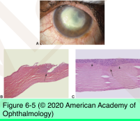
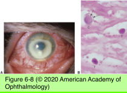
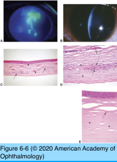
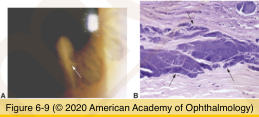
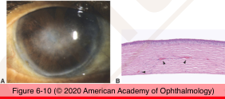
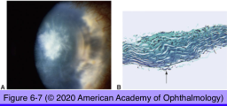

# 4.6.2. Cornea (II): Inflammations

## Images

## Hierarchy

- Bacterial infections
  - results from disruption of corneal epithelium
  - common bacteria
    - pseudomonas aeruginosa
    - staphylococcus aureus
    - streptococcus pneumoniae
    - enterobacteriacae
  - corneal scraping
    - neutrophils
    - necrotic debris
    - bacteria on Gram stain
- Acanthamoeba keratitis
  - soft contact lens wear
    - contaminated stagnant water
      - hot tubs
      - ponds
  - organisms
    - Acanthamoeba castellani
    - Acanthamoeba polyphagia
  - clinical features
    - severe pain
    - radial keratoneuritis
    - ring infiltrate
  - diagnosis
    - culture
      - nonnutrient blood agar layered with E. coli
      - late stage disease
        - organism penetrates into deep stroma
          - difficult to isolate from superficial scraping
    - confocal microscopy
    - histology
      - cysts
      - trophozoites
      - stain
        - PAS
        - H&E
        - calcofluor white
        - acridine orange
- Herpes simplex virus keratitis
  - dendrite
    - linear arborizing pattern
      - shallow ulceration
      - epithelial cell swelling
    - histology
      - subepithelial infiltration by chronic inflammatory cells
      - loss of the Bowman layer
  - stromal keratitis
    - may accompany or follow epithelial infection
    - stromal scarring ± vascularization
    - interstitial keratitis
      - chronic inflammatory cells
      - vascularization
  - endotheliitis
    - granulomatous reaction at the level of Descemet's membrane
    - disciform keratitis
  - diagnosis
    - corneal scraping
      - Giemsa stain
        - intranuclear viral inclusions
    - viral culture
    - antigen detection
    - PCR
  - postherpetic neurotrophic keratopathy
    - corneal anesthesia
    - featureless corneal stroma with paucity of keratocytes
- Infectious crystalline keratopathy
  - predisposing factor
    - long-term topical corticosteroid use
  - organisms
    - alpha-hemolytic streptococcus viridans
    - other bacteria
    - fungi
  - clinical features
    - crystalloid appearance of the opacity
      - no true crystals
      - along suture track
    - intact overlying epithelium
      - difficult to culture!
  - histology
    - bacterial colonies in stroma
      - Gram stain
      - GMS stain
      - PAS stain
      - H&E
    - little inflammatory cell infiltrate
- Interstitial keratitis
  - immunologic response to microorganisms
  - nonsuppurative
  - inflammatory cell infiltration in stroma
  - vascularization
  - intact overlying epithelium
  - chronic/recurrent IK
    - stromal scarring
  - organisms
    - transplacental infection by Treponema pallidum
      - congenital syphilis
    - herpes simplex
      - most common cause
    - Mycobacterium tuberculosis/Mycobacterium leprae
    - Borrelia burgdoferi
    - E-B virus
- Fungal keratitis
  - etiology
    - trauma
      - vegetable/plant
    - contact lens wear
    - topic corticosteroid use
  - organisms
    - septated filamentous
      - aspergillus
      - fusarium
    - nonseptated filamentous
      - mucor
    - yeast
      - candida
  - diagnosis
    - culture
      - sabouraud agar
    - corneal biopsy
      - histologic evaluation
        - Grocott-Gomori methenamine-silver nitrate (GMS)
        - PAS
      - PCR
  - fungi can extend into anterior chamber
    - unlike bacteria!
- Non-infectious keratitis
  - autoimmune disease
    - rheumatoid arthritis
    - graft-vs-host disease
  - topical medication toxicity
    - anesthetics
    - NSAIDs
    - antivirals
