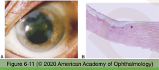
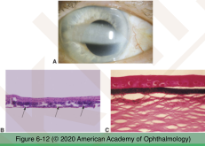
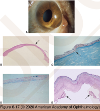
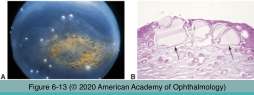
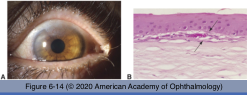
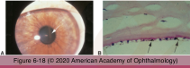
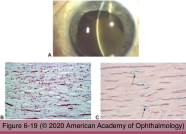
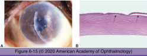
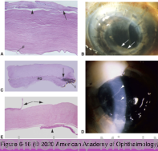

# 4.6.3. Cornea (III): Degenerations

## Images

## Hierarchy

- secondary changes in previously normal tissue
  - aging
  - not inherited
  - +- bilateral
- Salzman nodular degeneration
  - etiology
    - long-standing keratitis
    - idiopathic
  - middle-aged/older women
  - often have blepharitis
  - gray-white/bluish
  - flat or raised lesions
  - location
    - lid margin-cornea touch in primary gaze
      - central cornea
      - paracentral cornea
  - histology
    - irregular epithelial thickness
    - thick basement membrane
    - disorganized collagenous tissue at Bowman layer
- Calcific bank keratopathy
  - etiology
    - chronic local corneal disease
    - chronic inflammation
      - chronic juvenile idiopathic arthristis-associated uveitis
    - blind painful eyes
    - systemic hypercalcemia
  - clinical features
    - interpalpebral zone
    - spares peripheral cornea
  - histology
    - calcium deposition
      - Bowman layer
      - anterior stroma
    - stains
      - H&E
        - basophilic granules
      - alizarin red
        - red deposits
      - von Kossa
        - black deposits
- apex of protrusion and thinnest part are central/paracentral
  - thin zone is paracentral (pachymetry mapping)
    - not at the steepest point!
- keratoconus
  - demographics
    - adolescence/young adulthood
    - sporadic
      - .+ family history in some cases
        - 6-8%
  - predisposing conditions
    - isolated
    - systemic conditions
      - atopy
      - Down syndrome
      - Marfan syndrome
    - increased prevalence of keratoconus
      - atopy
      - Down syndrome
      - Marfan syndrome
      - mitral valve prolapse
      - Ehlers-Danlos syndrome type VI
      - xeroderma pigmentosum
      - other ocular conditions
        - floppy eyelid syndrome
        - Leber congenital hereditary optic neuropathy
        - numerous congenital anomalies of the eye
        - vernal keratoconjunctivitis (VKC)
  - clinical findings
    - corneal ectasia
      - central/inferocentral
      - inferior steepening (power map)
      - myopia/irregular astigmatism
    - apical scarring
    - spontaneous break in Descemet membrane
      - corneal hydrops
  - histology
    - focal discontinuities in Bowman layer
    - central corneal thinning
    - apical anterior stromal fibrosis
    - iron deposition at base of cone
      - basal epithelial layers
      - Fleischer ring
      - Prussian blue stain
    - break in Descemet membrane
    - amyloid deposition in anterior cornea
      - secondary localized amyloidosis
      - advanced cases
  - Pellucid marginal degeneration
    - stromal thinning more inferior
      - inferior, peripheral corneal thinning
    - inferior corneal steepening
      - “lobster claw” pattern
        - Figure 10-30
- Actinic keratopathy
  - other names
    - Labrador keratopathy
    - spheroidal degeneration
  - etiology
    - prolonged sun exposure
    - corneal inflammation
      - +- calcific band keratopathy
  - clinical features
    - interpalpebral fissure
    - golden-brown spheroidal deposits
  - histology
    - elastotic degeneration of corneal collagen
    - extracellular, proteinaceous, hyaline deposits with characteristics of elastotic degeneration
      - composition is not lipid!
    - stains
      - H&E stain
        - basophilic globules
          - Bowman layer
          - anterior stroma
      - Verhoeff-van Gieson stain
        - black
- Pannus
  - fibrous/fibrovascular tissue between epithelium and Bowman layer
  - +- Bowman layer disruption
  - etiology
    - chronic corneal edema
    - long-standing inflammation
- Pigment deposits
  - Krukenberg spindle
    - in pigment dispersion syndrome
      - Similar to KCS
      - young/middle-aged adults
      - myopia
      - posterior bowing of midperipheral iris
    - histology
      - melanin pigment deposition
        - within endothelial cells
        - extracellularly on posterior corneal surface
        - trabecular meshwork
  - Blood staining
    - hyphema + prolonged high intraocular pressure
    - histology
      - stromal
        - RBCs
          - Masson trichrome stain
        - hemoglobin
        - hemosiderin
          - cytoplasm of keratocytes
          - Prussian blue stain
  - Fleischer ring
- Bullous keratopathy
  - extensive endothelial cell loss
    - pseudophakic bullous keratopathy
    - silicone oil keratopathy
  - clinical features
    - Descemet folds
    - +- thick Descemet membrane
      - no guttae
    - stromal edema
    - separation of epithelium from Bowman membrane
      - microcysts
      - bullae
    - intracellular epithelial edema
    - pannus in severe cases
- Corneal graft failure
  - results from endothelial cell loss
    - gradually over time
    - acute
      - rejection
      - corneal ulcer
  - clinical findings
    - bullous keratopathy
    - retrocorneal membrane
      - fibrous downgrowth/ingrowth
      - epithelial downgrowth/ingrowth
      - risk factor
        - multiple prior PKs
      - poor prognostic sign
        - graft failure
        - secondary angle-closure glaucoma
