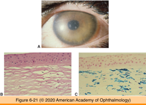
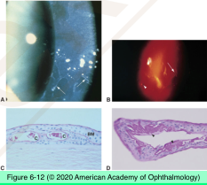
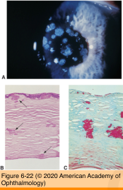
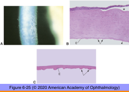
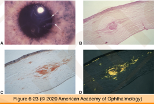
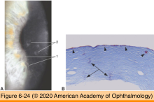

# 4.6.4. Cornea (IV): Dystrophies

## Images

## Hierarchy

- Epithelial dystrophy
  - primary, generally inherited, bilateral disorders
  - other names
    - map-dot-fingerprint dystrophy
    - Cogan microcystic dystrophy
    - anterior basement membrane dystrophy
  - demographics
    - most common corneal dystrophy
    - sporadic
      - sometimes autosomal dominant
  - histology
    - thick epithelial basement membrane
      - extends into the epithelium
        - map/fingerprint lines
      - encircles foci of epithelial cells
        - epithelial debris within cystoid spaces
          - dots
  - recurrent corneal erosion
- Stromal dystrophies
  - inherited
  - symptoms
    - decreased vision
    - recurrent corneal erosion
  - recur in corneal grafts
  - Macular dystrophy
    - autosomal recessive
      - carbohydrate sulfotransferase 6 gene
        - chromosome 16
          - 16q22
        - defect in sulfation of keratan sulfate
    - clinical findings
      - poorly defined focal opacities
      - hazy intervening stroma
    - histology
      - mucopolysaccharide depostion
        - interlamellar spaces
        - keratocytes
        - stains
          - alcian blue
            - acid mucopolysaccharides: blue
          - colloidal iron
      - corneal thinning
      - decreased # of endothelial cells
        - +- guttae
  - Granular dystrophy (type 1)
    - autosomal dominant
      - TGFß1 (ßig-h3 = BIGH3 = keratoepithelin)
        - chromosome 5
          - 5q31
    - clinical findings
      - central cornea
        - sharply defined opacities with intervening clear stroma
    - histology
      - hyaline material deposition
      - Masson trichrome stain
        - bright red
  - Lattice dystrophy (type 1)
    - autosomal dominant
    - central cornea
      - refractile lines
      - hazy intervening stroma
    - histology
      - amyloid deposition
        - anterior stroma
        - also
          - subepithelial
          - deep stroma
        - form of primary localized amyloidosis
      - stains
        - Congo red
          - orange
          - polarized light
            - birefringence
            - dichroism
        - crystal violet
          - metachromasia
        - thioflavin T
          - fluorescent stain
  - Avellino dystrophy
    - autosomal dominant
      - TGFß1 (ßig-h3 = BIGH3 = keratoepithelin)
        - chromosome 5
          - 5q31
    - features of granular and lattice dystrophy
    - histology
      - hyaline deposition
      - amyloid deposition
- Endothelial dystrophy
  - Fuchs dystrophy
    - inheritance
      - sporadic
      - autosomal dominant
    - clinical findings
      - guttae
        - young adulthood
      - corneal edema
        - middle-aged/elderly
        - bullous keratopathy
    - histology
      - excrescences of Descemet membrane
        - guttae
      - thick Descemet membrane
      - endothelial cell loss
      - secondary epithelial basement membrane changes
      - subepithelial fibrosis
    - treatment
      - endokeratoplasty
      - penetrating keratoplasty
  - Congenital hereditary endothelial dystrophy
    - see under congenital anomalies
  - Posterior polymorphous dystrophy
