# 4.7.1. Anterior Chamber & Trabecular Meshwork

## Images

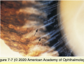

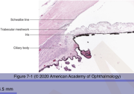

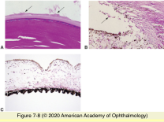

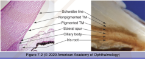

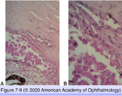

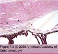

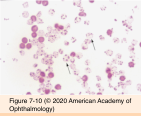

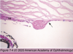

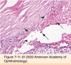

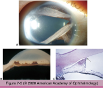

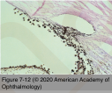

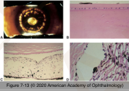

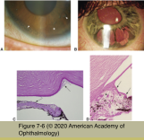

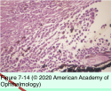

## Hierarchy

- Topography
  - boundaries
    - corneal endothelium
    - iris-ciliary body & pupillary portion of lens
    - trabecular meshwork (tm)
  - AC depth
    - 3.5 mm
  - embryology
    - TM
      - neural crest
    - Schlemm canal
      - mesoderm
  - landmarks
    - Schwalbe line
      - termination of Descemet membrane
    - scleral spur
      - triangular extension of sclera
        - insertion of outermost longitudinal ciliary body muscle
    - TM
    - Schlemm canal
    - nested in the groove formed by scleral spur and corneoscleral tissue
- Congenital anomalies
  - Primary congenital glaucoma
    - at birth or within first few years of birth
    - arrested development of AC angle structures
      - anterior insertion of iris root
        - anteriorly displaced ciliary processes
      - poorly developed scleral spur
        - insertion of ciliary body muscle directly into the TM
      - mesenchymal tissue in the anterior chamber angle
  - Anterior segment dysgenesis
    - abnormal neural crest migration and differentiation
    - Axenfeld-Rieger syndrome
      - autosomal dominant
      - clinical findings
        - posterior embryotoxon
          - thick & anteriorly displaced Schwalbe line
        - adherence of iris strands to Schwalbe line
        - iris hypoplasia
        - corectopia & polycoria
        - fetal AC angle
          - glaucoma
            - 50%
- Secondary glaucoma with material in the trabecular meshwork
  - Exfoliation syndrome (Pseudoexfoliation)
    - age >50 years
    - pathogenesis
      - abnormal aggregation of elastic fiber components
        - lysyl oxidase-like 1 gene (LOXL1)
          - 15q24
          - responsible for crosslinking of collagen and elastin
    - clinical findings
      - exfoliative material on surface of anterior segment structures
      - fibrillar material in the connective tissue of various visceral organs
    - pathology
      - feathery/brush-like fibrils
        - perpendicular to surface of anterior segment structures
          - trabecular meshwork
          - Schlemm canal
        - periodic acid-Schiff positive
      - saw-toothed iris pigment epitthelium
  - Phacolytic glaucoma
    - hypermature cataract
      - leakage of denatured lens protein through intact capsule
    - pathogenesis
      - occlusion of TM
        - lens protein
        - macrophages containing proteinaceous eosinophilic material
  - Trauma
    - intraocular hemorrhage
      - ghost cell glaucoma
        - hemolyzed RBCs
          - spherical
          - rigid
          - contain degenerated hemoglobin
            - Heinz bodies
      - hemolytic glaucoma
        - macrophages containing:
          - hemosiderin
          - hemoglobin
      - hemosiderosis oculi
        - hemosiderin deposition within TM endothelium
          - enzyme toxin
            - damages TM function
        - prussian blue stain
    - other causes
      - angle recession
      - cyclodialysis
      - iridodialysis
  - Pigment dispersion associations
    - causes
      - uveitis
      - uveal melanoma
        - macrophages that have ingested pigment obstruct the trabecular meshwork
      - pigment dispersion syndrome
        - clinical findings
          - pigment in:
            - TM
            - corneal endothelium
              - krukenberg spindle
            - lens capsule
          - radial midperipheral iris defects
            - contact of lens zonules with iris pigment epithelium
        - pathogenesis
  - Neoplasia
    - direct TM obstruction by tumor
      - iris/ciliary body melanocytic nevus
      - iris/ciliary body melanoma
      - conjunctival carcinoma invading the eye
    - melanomalytic glaucoma
      - TM obstruction by pigment released from tumor
        - iris/ciliary body melanoma
        - iris/ciliary body melanocytoma
- Degenerations
  - Iridocorneal endothelial syndrome
    - young/middle-aged adults
    - unilateral
    - histology
      - epithelial-like metaplasia and abnormal proliferation of the corneal endothelium
        - thin basement membrane
          - periodic acid-schiff positive
          - similar to Descemet membrane
      - abnormal endothelial cells migrate over AC angle
        - PAS
          - secondary angle-closure glaucoma
            - 1/2
    - clinical variants
      - essential (progressive) iris atrophy
        - severe progressive iris stromal & pigment epithelial atrophy
        - corectopia
        - ectropion uveae
        - hole formation
        - heterochromia
        - narrow anterior chamber
          - PAS formation
      - Chandler syndrome
        - the most common form
          - 50%
        - minimal iris atrophy and corectopia
        - corneal and angle findings predominate
      - Cogan-Reese (iris nevus) syndrome
        - less severe iris atrophy
        - membrane grows on the anterior iris surface
          - pinches off islands of the normal iris stroma
            - tan pedunculated nodules or diffuse pigmented lesions on the anterior iris surface
            - nodular/nevus-like appearance
