# 4.8.1. Sclera

## Images

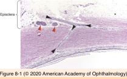

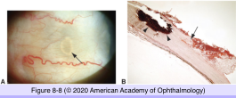

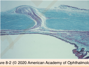

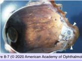

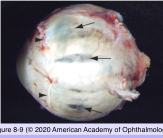

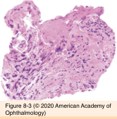

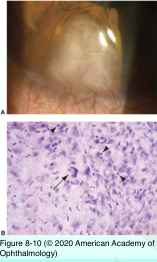

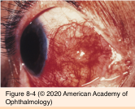

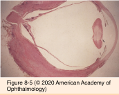

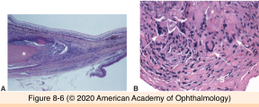

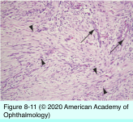

## Hierarchy

- Congential anomalies
  - Choristoma
    - Epibulbar dermoid
    - Episcleral osseous choristoma
  - Nanophthalmos
    - bilateral
    - short axial length = 15-20 mm
    - normal or slightly enlarged lens
    - thick sclera
      - impaired venous outflow
    - predisposition to uveal effusion
      - caused by
        - reduced protein permeability
    - glaucoma
      - angle closure
      - pupillary block
      - elevated episcleral venous pressure
    - histology
      - fraying/splitting of collagen fibrils
      - abnormal glycosaminoglycan matrix
- Topography
  - neural crest derivative
    - temporal sclera from mesoderm
  - covers 4/5 to 5/6 of eye surface area
  - posterioly
    - outer 2/3 merges with dura of optic nerve
    - inner 1/3 continues as lamina cribrosa
  - dimensions
    - diameter = 22 mm
    - thickness
      - posteriorly = 1 mm
      - posterior to muscle insertions = 0.3 mm
  - layers
    - episclera
      - loose fibrovascular tissue
    - stroma
      - type I collagen
        - 28-300 nm
        - compared to corneal collagen fibers, scleral fibers are:
          - thicker
          - more variable in thickness
          - more variable in orientation
      - emissary channels
        - posteriorly
          - posterior ciliary arteries
          - posterior ciliary nerves
        - equatorial
          - vortex veins
        - anteriorly
          - anterior ciliary arteries/veins
          - long posterior ciliary nerves (Axenfeld nerve loops)
    - lamina fusca
      - pigmented, fibrovascular tissue
      - binds uvea to sclera
      - strongest uveoscleral attachments
        - major emissary channels
        - anterior base of ciliary body
        - juxtapapillary region
- Degenerations
  - Senile Calcific Plaque
    - elderly
    - clinical findings
      - flat
      - firm
      - sharply circumscribed
      - gray
      - rectangular/ovoid
      - <=1cm
      - bilateral
      - anterior to medial & lateral rectus muscle insertions
    - histology
      - calcium
        - midportion of scleral stroma
        - granular deposition - confluent plaque
        - stains
          - von Kossa
          - alizarin red
  - Scleral staphyloma
    - scleral ectasia lined by uveal tissue
    - predisposing conditions
      - scleritis
      - thin sclera posterior to rectus muscle insertions
      - long-standing increased intraocular pressure in children
      - axial myopia in children
    - histology
      - thin sclera
      - +- fibrosis/scarring
- Inflammations
  - Episcleritis
    - Simple episcleritis
      - 3rd-5th decade
      - female=male
      - clinical
        - slightly tender sectorial red area
        - anterior episclera
      - predisposing condition
        - none
      - histology
        - vascular congestion
        - stromal edema
        - chronic nongranulomatous perivascular inflammation
    - Nodular episcleritis
      - female>male
        - in contrast to simple episcleritis
      - clinical
        - tender pink-red nodule
        - anterior episclera
      - predisposing condition
        - systemic disease
          - rheumatoid arthritis
            - in contrast to simple episcleritis
      - histology
        - necrobiotic granulomatous inflammatory infiltrate
          - palisading epithelioid histiocytes
          - central core of necrotic collagen
            - in contrast to simple episcleritis
  - Sclertitis
    - clinical
      - painful
      - progressive
    - predisposing condition
      - systemic autoimmune connective tissue diseases
    - Necrotizing scleritis
      - types
        - nodular
        - diffuse
          - brawny scleritis
      - histology
        - necrobiotic granuloma
          - central necrotic collagen
            - severe scleral thinning/ectasia
              - herniation of uveal tissue
                - scleromalacia perforans
          - palisading epithelioid histiocytes/ multinucleated giant cells
          - peripheral rim of lymphocytes/plasma cells
    - Nonnecrotizing scleritis
      - nongranulomatous perivascular lymphocytic/ plasmacytic infiltrate
      - +- vasculitis
        - fibrinoid necrosis of vessel wall
- Neoplasia
  - Fibrous histiocytoma
    - also know as
      - fibroxanthoma
      - fibrohistiocytic tumor
    - clinical findings
      - gelatinous gray vascularized nodule
        - corneoscleral limbus
      - more common in the orbit
    - histology
      - proliferation of fibrocytes & histiocytes
      - whorled pattern
      - malignant fibrous histiocytoma
        - increased mitotic activity
        - nuclear pleomorphism
        - necrosis
        - invasive growth pattern
        - does not metastasize
  - Nodular fasciitis
    - young adults
    - clinical findings
      - rapidly growing
      - round-oval
      - firm
      - white-gray nodule
      - 0.5-1.5 cm
      - location
        - limbus
        - anterior to rectus muscle insertion
    - histology
      - spindle cell proliferation
        - resemble firbroblasts growing in tissue culture
        - aggregate in short fascicles
        - +- mitotic figures
          - no unbalanced mitosis
          - may be misdiagnosed as sarcoma!
      - vascular myxoid stroma
        - chronic inflammatory infiltrate
        - foci of dense collagen deposition
