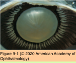
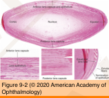
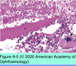
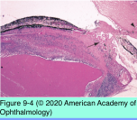
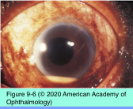
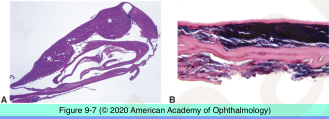
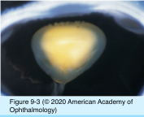

# 4.9.1. Lens (I)

## Images

## Hierarchy

- Topography
  - size
    - diameter = 9-10 mm
    - thickness = 5 mm
  - embryology
    - from surface ectoderm
  - Capsule
    - thick basement membrane
      - type IV collagen fibers
    - thickest
      - anteriorly = 12-21 micron
      - peripherally
    - thinnest posteriorly = 2-9 micron
  - Epithelium
    - from original lens vesicle
    - anterior
      - single layer of cuboidal cells
      - base toward anterior lens capsule
    - equatorial
      - mitotically active
      - more elongated
      - differentiate into lens fibers
        - equatorial lens bow
      - no epithelial cells posterior to equator
  - Cortex & nucleus
    - center of the lens
      - embryonic/fetal lens fibers
    - equatorial lens bow
      - epithelial cells
        - move centrally
        - elongate
        - acquire crystallins
  - Zonular fibers
    - attach to anterior and posterior lens capsule
      - lose organelles
    - attach to ciliary processes
- Inflammations
  - Phacoantigenic uveitis
    - also known as
      - phacoanaphylactic endophthalmitis
      - lens-induced granulomatous endophthalmitis
    - pathogenesis
      - accidental/surgical lens trauma
    - histology
      - central nidus of lens material
      - zonal granuloma
        - inner: multinucleated giant cells & neutrophils
        - middle: lymphocytes & plasma cells
        - outer: fibrovascular connective tissue
  - Phacolytic glaucoma
  - Propionibacterium acnes endophthalmitis
    - following cataract surgery
      - 2 mo - 2 years
      - after nd:YAG laser capsulotomy
    - clinical findings
      - granulomatous keratic precipitates
      - small hypopyon
      - vitritis
      - white plaque within the capsular bag
        - bacteria
          - gram-positive pleomorphic rod
        - residual lens material
- Congenital anomalies
  - Congenital aphakia
    - primary
      - failed induction of surface ectoderm
      - PAX6 gene mutations
      - severe ocular and systemic developmental anomalies
    - secondary
      - resorption/extrusion of lens before or during birth
      - congenital infections
        - congenital rubella
  - Lens coloboma
    - notch in the lens
    - inferonasal location
    - associated with ciliary body coloboma
    - abnormal development of zonular fibers
  - Anterior lenticonus (lentiglobus)
    - usually bilateral
      - Alport syndrome
        - autosomal dominant
        - mutation in type IV collagen
        - clinical findings
          - hemorrhagic nephritis
          - retinal flecks
            - deafness
          - retinal/iris neovascularization
          - anterior polar cataract
          - anterior lenticonus
    - oil droplet red reflex
    - histology
      - abnormal type IV collagen
        - thinning/dehiscence of anterior lens capsule
          - bulging of anterior lens cortex
      - decreased number of anterior lens epithelial cells
  - Posterior lenticonus (Lentiglobus)
    - more common than anterior lenticonus
      - sporadic
    - usually unilateral
    - +- bilateral
      - systemic associations
        - Alport syndrome
        - oculocerebrorenal syndrome of Lowe
          - x-linked
          - systemic acidosis
          - renal rickets
          - hypotonia
          - congenital cataract
            - focal, internally directed excrescences of lens capsule
          - microspherophakia
    - clinical findings
      - congenital cataract
        - oil droplet red reflex
      - rare
        - microphthalmos
        - microcornea
        - uveal coloboma
        - persistent anterior hyaloid vasculature
- unlike anterior lenticonus
