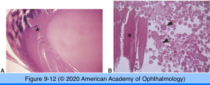
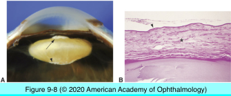
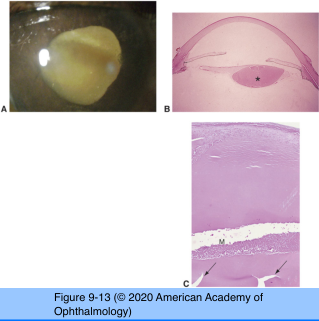
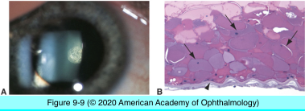
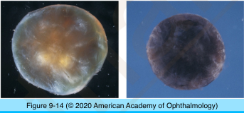
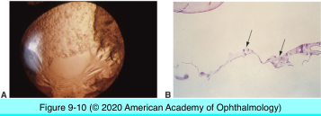
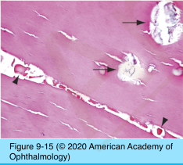
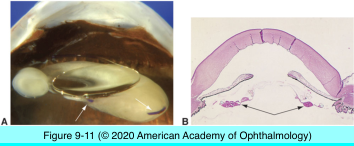

# 4.9.2. Lens (II): Degenerations

## Images

## Hierarchy

- Capsule
  - thickening
    - chronic inflammation
    - pathologic proliferation of lens epithelium
  - pigmented deposits
    - copper (chalcosis)
    - silver (argyrosis)
- Cortex
  - cortical degenerative changes
    - ultraviolet light exposure
    - 2 categories
      - generalized discoloration with loss of transparency
        - cannot be diagnosed histologically
      - focal opacifications
        - hydropic swelling of lens fibers
          - decreased intensity of eosinophilic staining of lens fibers
        - liquefactive change
          - focal opacities become more apparent
        - accumulation of eosinophilic globules
          - morgagnian globules
          - in slit-like spaces between lens fibers
        - morgagnian cataract
          - liquefied cortex
          - sunken nucleus
          - wrinkled capsule
  - phacolytic glaucoma
    - denatured lens protein escapes though intact lens capsule
    - anterior chamber macrophagic inflammatory reaction
- Epithelium
  - glaukomflecken
    - severe elevation of intraocular pressure
    - white flecks beneath lens capsule
    - histology
      - necrotic epithelial cells
      - degenerated subepithelial cortical material
  - anterior subcapsular fibrous plaque
    - etiology
      - inflammation
      - ischemia
      - trauma
    - histology
      - epithelial hyperplasia
      - epithelial metaplasia
        - fibroblast-like cells
          - collagen
      - duplication cataract
        - new capsule surrounding fibrous plaque
  - siderosis
    - iron-containing foreign bodies
    - iron within epithelial cells
      - lens epithelial degeneration/necrosis
    - Perls Prussian blue stain
  - posterior subcapsular cataract
    - risk factors
      - chronic inflammation
      - diabetes mellitus
      - ionizing radiation
      - smoking
      - prolonged corticosteroid use
    - histology
      - epithelial disarray at the equator
      - posterior migration of lens epithelium
      - enlargement & swelling of posteriorly migrating epithelial cells
        - 5-6 x normal size
        - bladder cells of Wedl
  - Elschnig pearls
    - after cataract surgery
    - collections of proliferating epithelial cells
      - partially transparent globular masses
      - identical to bladder cells of Wedl
    - inner surface of posterior lens capsule
      - posterior capsular opacity
  - Soemmering ring cataract
    - incomplete cortical removal during cataract surgery
    - proliferating lens fibers in equatorial region
    - doughnut-shaped configuration
- Nucleus
  - aging
    - nuclear sclerosis
      - compression/hardening of lens nucleus
      - nuclear discoloration
        - urochrome pigment
      - histology
        - homogeneous eosinophilic appearance
        - loss of cellular laminations
        - crystalline deposits of calcium oxalate
          - birefringent under polarized light
