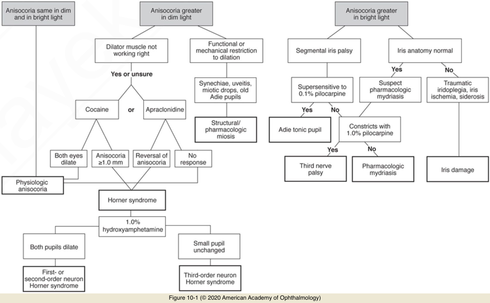

# 5.10.2. Pupillary Abnormalities (II): Anisocoria (I)

## Images

## Hierarchy

- Anisocoria Equal in Dim and Bright Light
  - Physiologic anisocoria
    - difference in pupil size ≥0.4 mm
      - usually < 1.0 mm
    - most common cause of anisocoria
      - 20% of population
    - equal in dim and bright light
      - pupillary light reflex and dilation are symmetric between both eyes
      - can vary from day to day
      - ± more apparent in dim light
        - ptosis on the side of the smaller pupil may create diagnostic confusion with Horner syndrome
- Anisocoria Greater in Dim Light
  - Mechanical anisocoria
    - trauma
    - inflammation
    - posterior synechiae
  - Pharmacologic miosis
    - pilocarpine
      - small, poorly reactive pupil
  - Physiologic anisocoria
  - Horner syndrome
- Anisocoria Greater in Bright Light
  - Iris damage
  - Pharmacologic mydriasis
  - Adie tonic pupil
  - Third nerve palsy
- Benign Episodic Pupillary Mydriasis
  - springing pupil
  - young, healthy individuals
  - episodic unilateral mydriasis
    - each episode is self-limiting
      - no associated systemic or neurologic disease
      - minutes to hours
    - mild blurring of vision
    - periocular discomfort
    - headache
