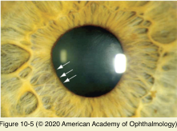
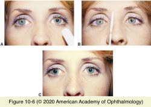
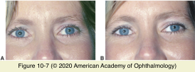

# 5.10.3. Pupillary Abnormalities (III): Anisocoria (II): Anisocoria Greater in Bright Light

## Images

## Hierarchy

- Iris damage
  - blunt trauma
    - initial miosis due to spasm
    - mydriasis due to iris sphincter damage
      - notches in the pupillary margin
      - transillumination defects near the sphincter muscle
        - poor response to light and near stimulation
      - does not respond to topical pilocarpine (1% or 2%)
      - mimics pharmacologic mydriasis
        - in patients with head trauma, the dilated pupil may be mistaken as a sign of third nerve palsy due to uncal herniation
  - prolonged/recurrent angle closure
  - intraocular surgery
- in contrast to an Adie pupil, which causes segmental sphincter paralysis
  - careful slit lamp examination can help the clinician make this distinction
- Adie tonic pupil
  - pathogenesis
    - damage to ciliary ganglion or short ciliary nerves (postganglionic parasympathetic nerve injury)
      - reduction in number of ganglion cells in ciliary ganglion
  - etiology
    - local ocular/orbital processes
      - surgery
      - trauma
      - laser procedure
      - infection
      - inflammation
      - ischemia
        - diabetes mellitus
    - widespread autonomic dysfunction
      - chronic alcoholism
      - dysautonomias
      - neurosyphilis
      - amyloidosis
      - sarcoidosis
      - Miller-Fisher variant of Guillain-Barré syndrome
    - idiopathic tonic pupil
      - Adie pupil
        - 70% female
          - Charcot-Marie-Tooth disease
        - 80% unilateral
          - second pupil may later become involved
            - 4%/year
        - Holmes-Adie syndrome
          - diminished deep tendon reflexes
          - orthostatic hypotension
  - clinical presentation
    - acute denervation phase
      - pupil is dilated
        - poorly reactive to light and accommodation
        - sectoral palsy of the iris sphincter
          - iris crypts stream toward areas of normal sphincter function
            - stroma bunches up along the pupillary border in such areas
          - stromal thinning/atrophy is observed in areas of sphincter paralysis
    - recovery phase
      - damaged short ciliary nerves regenerate
        - misguided accommodative fibers sprout onto the iris sphincter
          - pupil recovers its ability to constrict to accommodative (or near) effort
      - light–near dissociation
        - impaired pupillary light reflex
        - strong tonic pupillary response to near vision
          - followed by slow redilation
            - pupillary movement (both constriction and subsequent redilation) is delayed and slow (tonic)
    - denervation cholinergic supersensitivity
      - dilute pilocarpine eyedrops (0.1%)
        - after 60 minutes
          - affected pupil will constrict more than the normal pupil
      - 80%
    - symptoms
      - no symptoms
      - accommodative symptoms
        - difficult to treat
        - usually resolve spontaneously within a few months
      - photophobia
        - topical dilute pilocarpine (0.1%)
        - with time (months to years), an Adie tonic pupil gets smaller
- Pharmacologic mydriasis
  - no reactivity to light and near stimulation
  - paralysis of the entire sphincter
  - pilocarpine (1% or more) will not reverse the mydriasis
    - when mydriasis is induced by an anticholinergic drug such as atropine
      - mydriasis due to Adie pupil or third nerve palsy is easily overcome with full-strength or dilute pilocarpine
  - adrenergic mydriasis
    - dilated pupil
    - blanched conjunctiva
      - wide palpebral fissure
    - accommodation is not impaired
    - medications used to treat glaucoma may cause anisocoria if administered in only 1 eye
- Third nerve palsy
  - pupillary involvement is almost always accompanied by ptosis and limited ocular motility
    - motility disturbance may be subtle
  - when the pupil is involved, an aneurysm at the junction of the internal carotid and posterior communicating arteries must be excluded
  - if the pupil is spared and all other functions of the third nerve are completely paretic, an aneurysm can likely be ruled out
  - aberrant regeneration of the oculomotor nerve may cause
    - mydriasis
    - synkinetic pupillary reaction
      - portions of the pupillary sphincter contract with attempted movement of the eye, especially medially
