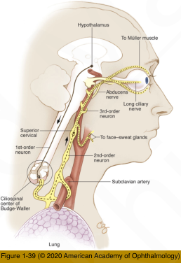
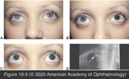
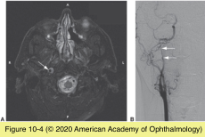

# 5.10.4. Pupillary Abnormalities (IV): Anisocoria (III): Horner Syndrome

## Images

## Hierarchy

- Pathogenesis
  - lesion at any point along the oculosympathetic pathway
- Clinical presentation
  - miosis
    - normal pupillary light reflex
    - slow redilation
  - facial anhidrosis
    - central (first-order) or preganglionic (second- order) neuron
      - ipsilateral face
    - postganglionic (third-order) neuron
      - ipsilateral forehead
  - ptosis
    - combination of upper lid and lower lid ptosis
      - narrower palpebral fissure
        - false impression of enophthalmos
  - acute phase
    - conjunctival hyperemia
    - ocular hypotony
  - iris hypochromia
    - congenital Horner's
- ETIOLOGY
  - first-order (preganglionic) lesion
    - medullary lesion
      - ataxia, nystagmus, and hemisensory deficit
      - MRI of the brain and upper cervical cord
  - second-order (preganglionic) lesion
    - superior sulcus (Pancoast syndrome) or mediastinal lesion
      - arm pain, cough, hemoptysis, and swelling in the neck
      - cervicothoracic MRI
    - thyroid mass
    - chest surgery
    - thoracic aortic aneurysms
    - trauma to the brachial plexus
  - third-order (postganglionic) lesion
    - numbness over the first as well as the second or third divisions of CN V
    - double vision from sixth nerve palsy
    - isolated postganglionic Horner syndrome is often benign
      - if examination of old photographs verifies that the Horner syndrome has been present for several years, further investigation will probably be unrewarding
      - no pain
    - painful postganglionic Horner syndrome
      - carotid artery dissection
        - pain around the temple and orbit
          - may extend to the throat
        - amaurosis fugax
        - altered taste (dysgeusia)
        - stroke is a possible complication
          - in the acute stage
        - MRI shows an intramural hemorrhage
          - in rare cases MRA or cerebral arteriography is needed
      - cluster headache
        - Horner syndrome often resolves
          - may become permanent after repeated attacks
      - Raeder paratrigeminal syndrome
        - Horner syndrome + daily unilateral headache (neuralgia)
        - no underlying pathology
          - middle-aged men
          - diagnosis of exclusion!
  - congenital Horner syndrome
    - birth trauma to the brachial plexus
  - nontraumatic Horner syndrome in infants and children
    - neuroblastoma
      - sympathetic chain of the chest
      - imaging of the head, neck, and chest
      - increased catecholamines and their metabolites in urine
        - less sensitive than imaging studies
- pharmacological confirmation
  - cocaine (4-10%)
    - blocks re-uptake of norepinephrine at sympathetic nerve terminals
      - affected eye
        - no effect
          - little or no norepinephrine is released into the synaptic cleft
      - unaffected eye
        - eyelid retraction
          - pupillary dilation
        - conjunctival blanching
    - technique
      - instill 2 drops of cocaine (4% or 10%) in each eye
        - measure amount of anisocoria after 45 minutes
          - anisocoria of ≥1 mm is diagnostic of Horner syndrome on the side of the smaller pupil
    - mechanical anisocoria can cause false- positive cocaine test result
      - topical phenylephrine (10%)
        - mechanically restricted pupil will remain small
        - Horner pupil will readily dilate
  - apraclonidine (0.5-1%)
    - weak α1-adrenergic agonist
      - affected eye
        - pupil dilation
          - in sympathetically denervated eyes the iris dilator is supersensitive to adrenergic substances
          - Figure 10-2
        - ptosis improves
          - little effect
      - unaffected eye
    - avoid in children <1 year
      - may cause central nervous system depression and acute respiratory arrest
      - use cocaine
  - hydroxyamphetamine (1%)
    - release of norepinephrine from an intact third- order (postganglionic) neuron
      - affected eye with third-order (postganglionic) Horner
        - brimonidine does not have enough α1- adrenergic activity
        - no pupil dilation
      - affected eye with first- or second-order Horner
        - pupil dilation
      - unaffected eye
        - pupil dilation
    - for localization after diagnosis of Horner is established
      - has fallen out of favor
- brimonidine should be avoided <3 years
  - brimonidine cannot be used as a substitute for apraclonidine
