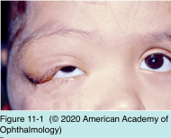
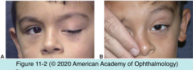
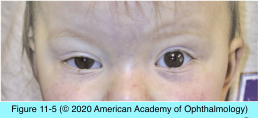
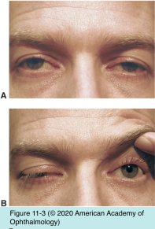
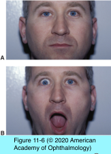
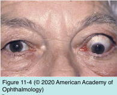

# 5.11.1. Eyelid or Facial Abnormalities (I): Ptosis (I)

## Images

## Hierarchy

- Congenital Ptosis
  - dystrophic development of the levator muscle
    - most common
    - clinical presentation
      - unilateral or bilateral
        - decreased levator function
      - eyelid lag
      - poorly formed (or absent) upper eyelid crease
    - ± other congenital ocular or orbital abnormalities
      - blepharophimosis syndrome
      - congenital fibrosis of the extraocular muscles
      - superior rectus weakness
  - Marcus Gunn jaw-winking syndrome
    - external pterygoid–levator form
      - eyelid elevates
        - movement of the mandible to the opposite side
        - jaw protrusion
        - wide opening of the mouth
    - ptosis may worsen with movement of the jaw
      - not common
  - congenital tumors
    - hemangiomas
    - neurofibromas
  - be aware of the potential for amblyopia as a result of occlusion or anisometropia
- Examination Techniques
  - general shape and appearance
    - S-shaped ptosis
      - neurofibromatosis
  - blink rate
    - low in Parkinson disease
    - high in blepharospasm
  - unilateral ptosis
    - exclude pseudoptosis
      - vertical strabismus (hypotropia)
      - contralateral lid retraction
  - evert eyelids
    - retained contact lens
    - giant papillary conjunctivitis
  - asymmetric ptosis
    - manually raise the ptotic eyelid to see if the higher eyelid drops to a new position
      - myasthenia gravis
      - not specific
  - 4 important clinical measurements
    - margin reflex distance
    - vertical palpebral fissure height
    - upper eyelid crease position
    - levator function
  - eyelid movement during target pursuit from upgaze to downgaze
    - eyelid lag
      - thyroid eye disease
      - aberrant regeneration of the third cranial nerve (CN III)
  - suspected fatigable ptosis caused by myasthenia gravis
    - patient fixates on the clinician’s elevated hand
      - watch for progressive ptosis as the patient attempts to hold this position
  - Cogan lid-twitch sign
    - have the patient fixate in downgaze for a few seconds and then rapidly refixate straight ahead
      - upward overshoot of the eyelid followed by fluttering as the lid settles into position
        - feature of myasthenia gravis
  - evaluation of facial motor function
    - eyelid closure
      - to determine if it is incomplete (lagophthalmos)
    - assessing the strength of the orbicularis oculi and other facial muscles
  - reinnervation phenomena (synkinesis)
    - eyelid closure and facial tics
      - signs of a previous injury to CN VII
        - Figure 11-8
  - exophthalmos
    - thyroid eye disease
  - enophthalmos
  - anisocoria
    - sympathetic nervous system disruption
      - may result in apparent ptosis and narrowing of the palpebral fissure
    - dysfunction of CN III with parasympathetic nervous system involvement
  - assess “neighboring” cranial nerves
  - check ocular motility for subtle weakness
- internal pterygoid–levator form
  - eyelid elevates
    - when the teeth are clenched
