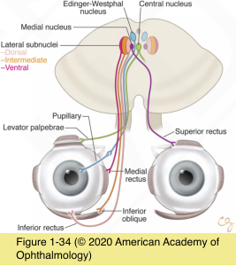

# 5.11.2. Eyelid or Facial Abnormalities (II): Ptosis (II)

## Images

## Hierarchy

- Apraxia of Eyelid Opening
  - rare
  - clinical presentation
    - unilateral or bilateral ptosis
    - inability to voluntarily open the eyelids
    - facial grimacing
      - frontalis contraction
  - supranuclear origin
    - extrapyramidal disease
      - Parkinson disease
      - multiple system atrophy
      - Huntington disease
      - Wilson disease
      - bilateral frontal lobe infarcts
        - progressive supranuclear palsy
    - essential blepharospasm
- Acquired Ptosis
  - See Table 11-1
  - single central nucleus innervates both levator palpebrae muscles
  - Neurogenic ptosis
    - bilateral ptosis
      - may be the only manifestation of a nuclear third nerve palsy
    - associated abnormalities in pupillary size and extraocular movements
  - Cerebral ptosis
    - lesion of the cerebral (typically right) hemisphere
    - bilateral or unilateral
    - transient
  - Systemic disorders
    - myasthenia gravis
    - chronic progressive external ophthalmoplegia
    - oculopharyngeal dystrophy
    - myotonic dystrophy
    - botulism
      - bilateral ptosis
      - poorly reactive pupils
      - ophthalmoplegia
      - facial paralysis
      - generalized proximal muscle weakness
    - Miller Fisher syndrome (variant of Guillain- Barré syndrome)
      - facial diplegia
      - bilateral ptosis
      - ophthalmoplegia
      - areflexia
      - ataxia
      - respiratory and swallowing difficulties
  - long-term use of steroid eyedrops
    - localized steroid-induced myopathy of the levator muscle
      - ptosis
  - posterior sub-Tenon steroid injections
  - Levator aponeurotic defects
    - the most frequent cause of acquired ptosis
    - levator function is usually normal
    - stretching, dehiscence, or disinsertion of the levator aponeurosis
    - frequent eye rubbing
    - prolonged contact lens use
    - intraocular surgery
      - eyelid speculum
  - Traumatic and mechanical
    - generally evident from inspection of the eyelids
- Pseudoptosis
  - brow ptosis
  - dermatochalasis
  - eyelids inadequately supported by the globe
    - microphthalmos
    - phthisis bulbi
  - hypotropia
  - contralateral lid retraction
- high eyelid crease
