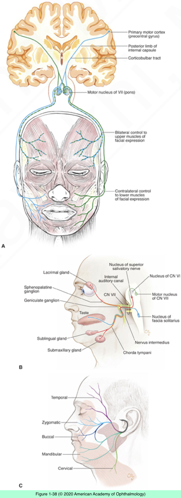
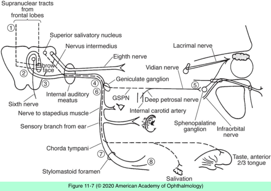

# 5.11.4. Eyelid or Facial Abnormalities (IV): Abnormalities of Facial Movement

## Images

## Hierarchy

- assessment of the facial nerve
  - motor function
    - with the patient at rest, note any asymmetry of facial expression or eyelid blink
    - palpebral fissure on the side of seventh nerve paresis will be wider
    - test the various muscle groups by asking the patient
      - to smile
      - to forcibly close the eyes
        - degree to which the eyelashes become buried on each side
      - to wrinkle the forehead
    - note aberrant facial movements at rest or during volitional movement
  - sensory function
    - corneal blink reflex
      - provides a functional assessment of the seventh and fifth nerves
    - whisper or quiet watch
      - to test hearing and assess possible CN VIII involvement
        - cerebellopontine angle tumors
    - sugar or vinegar on the anterior two-thirds of the tongue to test taste
    - cutaneous sensation along the posterior aspect of the external auditory canal and tympanic membrane
  - autonomic function
    - salivation and lacrimation
- localization
  - lesions from the cerebellopontine angle to the geniculate ganglion
    - impair all functions of the nerve
  - lesions distal to the geniculate ganglion
  - pontine lesions proximal to the joining of the motor portion of the seventh nerve with the intermediary nerve
    - dissociation of motor, sensory, and autonomic functions
      - affect only certain functions, depending on their location
  - testing should include functions of the fifth, sixth, and eighth nerves
- aberrant facial regeneration
  - after any facial neuropathy, but most commonly after Bell palsy
    - regenerating axons may reinnervate different muscles
    - involved facial muscles may remain weak
  - synkinetic movements
    - each blink may cause a twitch of the corner of the mouth
    - movements of the lower face may produce involuntary eyelid closure
  - lacrimation caused by chewing
    - crocodile tears
    - develops after severe injury to the proximal seventh nerve
    - fibers originally supplying mandibular and sublingual glands reinnervate the lacrimal gland
      - by way of the greater superficial petrosal nerve
    - may be accompanied by
      - decreased reflex tearing
      - decreased taste from the anterior two-thirds of the tongue
