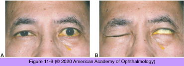

# 5.11.6. Eyelid or Facial Abnormalities (VI): Seventh Nerve Underactivity (II): Peripheral Lesions

## Images

## Hierarchy

- ipsilateral facial weakness
  - testing sensory and autonomic functions of the seventh nerve helps localize the lesion
- infectious agents
  - meningitis
  - Lyme disease
    - unilateral or bilateral facial palsy
      - in endemic areas, ≤25% of cranial nerve VII palsies may be attributed to LD
    - prognosis for seventh nerve recovery following treatment is excellent
  - Ramsay Hunt syndrome
    - Herpes zoster involving the seventh nerve
    - vesicles
      - along the posterior aspect of the external auditory canal
      - over the tympanic membrane
      - on the pinna
    - pain is often severe
      - postherpetic neuralgia may result
    - prognosis for recovery is less promising than for Bell palsy
- AIDS
  - isolated seventh nerve palsy (or other isolated or multiple cranial nerve palsies) may be the first sign of HIV seroconversion
- otitis media
  - may spread to involve the seventh nerve
- sarcoidosis
  - parotid gland inflammation
    - noncaseating granulomatous
      - most commonly involved cranial nerve
    - seventh nerve palsy
      - bilateral
        - asymmetric
- Bell palsy
  - most common type of facial neuropathy
  - pathogenesis
    - autoimmune or viral-induced inflammatory or ischemic injury
  - adults
  - sudden onset
  - pain
    - may precede the palsy or occur concurrently
  - ± diminished taste
  - ± facial numbness
    - cutaneous sensation is usually intact
  - ± dysacusis
  - predisposing factors
    - diabetes mellitus
    - pregnancy
    - family history of Bell palsy
  - diagnosis of exclusion
  - clinical course
    - spontaneous recovery
      - 85%
        - begins within 3 weeks of onset
          - if facial weakness progresses > 3 weeks, an alternative etiology should be considered
        - complete by 2–3 months
          - subtle signs of aberrant regeneration are commonly present
      - in the remaining patients, recovery is incomplete, and aberrant regeneration is common
    - electrical stimulation testing
      - helpful in predicting recovery
  - poor prognostic signs
    - complete facial palsy presentation
    - impairment of lacrimation
    - dysacusis
    - advanced age
  - treatment
    - 7–10-day course of oral corticosteroids
      - edema of the nerve within a tight fallopian canal contributes to nerve damage
      - recommended for patients evaluated within the first 72 hours
    - combination of antiviral agents with corticosteroids may provide additional benefit
      - large trials found that use of an antiviral drug, either alone or in combination with corticosteroids, conferred no benefit
- Guillain-Barré syndrome
  - especially the variant Miller Fisher syndrome
    - anti-GQ1b IgG antibodies in serum
    - facial diplegia
    - ophthalmoplegia
    - elevated CSF protein level with a normal cell count
      - absent deep tendon reflexes
  - recovery is generally complete
    - serologic test results improve with clinical improvement
- head trauma
  - Battle sign
    - ecchymosis over the mastoid area
    - associated with fractures of the temporal bone
  - birth trauma
    - use of forceps
    - congenital facial palsy
      - tends to resolve
- Melkersson-Rosenthal syndrome
  - begins in childhood or adolescence
  - recurrent unilateral or bilateral facial paralysis
  - chronic facial swelling
    - facial swelling is frequently marked
    - ± bilateral
      - even when facial paresis is only unilateral
  - lingua plicata (furrowing of the tongue)
- bilateral seventh nerve palsy
  - sarcoidosis
  - basilar meningitis (bacterial, viral, spirochetal)
  - Guillain-Barré syndrome
  - Melkersson-Rosenthal syndrome
- neoplasms
  - location
    - cerebellopontine angle
      - acoustic neuroma
      - meningioma
      - clinical features
        - concomitant impairment of the fifth, sixth, or eighth cranial nerves
        - cerebellar signs
    - fallopian canal
    - parotid gland
  - most are histologically benign and slow growing
  - best evaluated through MRI with intravenous contrast
- recurrent unilateral seventh nerve palsy
  - idiopathic
  - diabetes mellitus
  - Lyme disease
  - Melkersson-Rosenthal syndrome
- progressive seventh nerve palsy
  - neoplastic etiology
    - tumor invasion
      - brainstem
      - cerebellopontine
      - parotid gland
    - meningeal carcinomatosis
