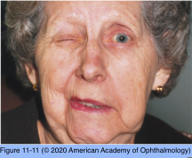
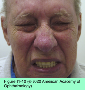

# 5.11.7. Eyelid or Facial Abnormalities (VII): Seventh Nerve Overactivity

## Images

## Hierarchy

- Hemifacial spasm
  - clinical presentation
    - episodic spasm that involves the facial musculature
    - unilateral
    - few seconds to minutes
    - begins as intermittent twitching of the orbicularis oculi muscle
      - episodes may increase in frequency for weeks-months
        - then abate for months at a time
    - seventh nerve function is usually intact
      - over time subtle ipsilateral facial weakness may develop
  - pathogenesis
    - compression of the seventh nerve root by an aberrant vessel
    - less commonly (perhaps 1%)
      - cerebellopontine angle tumors
        - MRI of the brain, including the course of the facial nerve, to exclude a compressive lesion
      - treatment of choice
        - previous injury to CN VII
  - treatment
    - botulinum toxin type A
      - very effective
      - into the periocular and facial muscles
      - reinjection every 3–4 months
      - responds to lower doses of botulinum toxin than does blepharospasm
    - medical treatment
      - carbamazepine
      - clonazepam
      - baclofen
      - may provide improvement in some patients
    - microvascular decompression
      - for advanced cases or younger patients
        - suboccipital craniectomy with placement of a sponge between the seventh nerve and the offending blood vessel
      - may offer a cure
- Essential blepharospasm
  - etiology
    - exact cause unknown
    - basal ganglia dysfunction
  - clinical presentation
    - onset between 40-60 years
    - bilateral
    - episodic contraction of the orbicularis oculi
      - initially, mild and infrequent
    - stress may exacerbate the condition
    - psychological distress
      - patients withdraw socially as the symptoms worsen
        - may progress to the point that patient’s daily activities are severely disrupted
          - patient’s eyelids cannot be pried open during an episode of spasm
    - associated findings
      - facial grimacing
        - Meige syndrome
      - cogwheeling in the neck and extremities
      - other extrapyramidal signs
    - neuroradiologic studies are generally unrevealing and rarely indicated
  - differential diagnosis
    - tardive dyskinesia
      - secondary to neuroleptic and antipsychotic drugs
        - can produce spasms that involve the mouth
    - extrapyramidal disorders
      - may be accompanied by some degree of blepharospasm
    - reflex blepharospasm
      - severely dry eyes
      - intraocular inflammation
      - meningeal irritation (usually associated with photophobia)
  - treatment
    - neuroleptics and benzodiazepines
      - limited efficacy
    - tinted lenses such as FL-41 tint
      - improve blink frequency and light sensitivity
    - injection of botulinum toxin type A
      - treatment of choice
      - into the orbicularis oculi muscle
        - 4–8 injection sites per eye
        - avoid central portion of the pretarsal orbicularis oculi muscle to minimize ptosis
      - lasts only a few months
        - repeat injections are necessary
      - if botulinum toxin type A fails, botulinum toxin type B may be an alternative
      - complications
        - ptosis
        - local ecchymosis
        - ectropion
        - diplopia
        - lagophthalmos
          - exposure keratopathy
        - usually mild and transient
  - surgical therapy
    - when medical treatment fails
    - meticulous extirpation of the eyelid protractors
    - selective ablation of the seventh nerve
      - lower success rate
      - risk of greater complications
- Spastic paretic facial contracture
  - rare
  - unilateral facial contracture with associated facial weakness
  - begins with myokymia of orbicularis oculi muscle
    - gradually spreads to most of ipsilateral facial muscles
  - tonic contracture of the affected muscles becomes evident
  - over weeks to months, ipsilateral facial weakness develops
    - voluntary facial movements diminish
  - sign of pontine dysfunction in the region of the seventh nerve nucleus
    - pontine neoplasm
    - involvement of supranuclear connections leads to facial spasticity
    - damage to nucleus causes facial weakness
- Other conditions
  - focal cortical seizure
    - gross clonic movements involving 1 side of the face
    - ± ipsilateral clonic hand movements
    - eyes deviate away from the side of the seizure focus
    - Todd paralysis
      - transient supranuclear facial paresis, follows the seizure
    - electroencephalogram
      - eyes may deviate toward the side of the prior seizure focus
  - oral facial dyskinesias
    - tardive dyskinesia
    - after long-term use of major tranquilizers
    - may persist even after the drugs are stopped
  - habit spasm
    - stereotyped, repetitive, reproducible facial movements
      - facial tic
      - nervous twitch
    - relatively common, particularly in childhood
      - can be promptly inhibited on command
    - tend to disappear in time without treatment
  - Tourette syndrome
    - rarely may present with facial twitching alone
- Facial myokymia
  - clinical presentation
    - continuous unilateral fibrillary or undulating contraction of facial muscle bundles
    - occasionally, begins within a portion of the orbicularis oculi and spreads to facial muscles
  - pathogenesis
    - intramedullary disease of the pons involving the seventh nerve nucleus or fascicle
      - pontine glioma in children
      - multiple sclerosis in adults
      - Guillain-Barré syndrome
        - rarely
  - treatment
    - carbamazepine
    - phenytoin sodium
    - injection of botulinum toxin
  - benign eyelid fasciculations
    - Intermittent fluttering of the orbicularis oculi
    - relatively common
    - usually lasts for days or weeks
- repetitive, stereotyped, involuntary movements and vocalizations called tics
