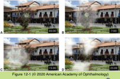

# 5.12.1. Head, Ocular, & Facial Pain (I): Migraine (I)

## Images

## Hierarchy

- Migraine and Tension-type Headache
  - General
    - common primary headache
      - 6%–8% of men
      - 15%–18% of women
    - history
      - strong family history of migraine
      - motion sickness as a child
    - symptoms
      - repetitive bouts of headache
        - unilateral
        - pulsating
      - nausea or vomiting
      - photophobia
    - clinical course
      - episodes may decrease after menopause
        - onset of migraine during puberty or young adulthood
    - migraine may be exacerbated by
      - routine physical activity
      - menstruation
      - pregnancy
      - hunger
      - stress
      - certain foods (eg, chocolate or wine)
      - sleep deprivation
  - Migraine with aura (classic migraine)
    - 30% of migraine cases
    - pathophysiology
      - activation of trigeminal nucleus caudalis
        - release of vasoactive chemokines at the vascular endings
          - dilation of the pial arteries
          - increased vascular permeability
          - inflammatory response
          - activates trigeminal afferent fibers within the walls of blood vessels
    - aura
      - neurologic symptoms
        - usually visual
      - positive phenomena
        - typically have movement
      - fortification spectrum
        - a small scotoma that gradually expands into the peripheral vision
          - over minutes
        - bounded by a zigzag, shimmering, colorful or silvery image
      - hemianopic distribution
        - perceived by the patient as monocular
          - in the eye ipsilateral to the temporal defect
      - loss of vision may occur
      - nausea
        - lasts <60 minutes
      - photophobia
    - throbbing headache
      - follows the aura
      - untreated, lasts 4-72 hours
    - basilar-type migraine (previously complicated migraine)
      - transient ischemia within the distribution of the basilar artery
      - bilateral vision loss
      - diplopia
      - vertigo
      - dysarthria
      - ataxia
      - loss of consciousness
      - focal neurologic deficit
        - may be part of the aura
        - may occur with the headache
        - usually transient
          - permanent deficits consequent to intracranial infarction may occur
  - Migraine without aura (common migraine)
    - 65% of migraine cases
    - headache
      - global
      - can last hours to days
        - not strictly unilateral
    - differential diagnosis
      - tension-type headache
  - Migraine aura without headache
    - acephalgic migraine
      - visual symptoms of migraine aura without an associated headache
    - 5% of migraine cases
    - occurs mainly in adults with a prior history (family history) of migraine with aura
    - clinical presentation
      - scintillating scotoma
      - transient homonymous hemianopia without positive visual phenomena
      - peripheral visual field constriction progressing to tunnel vision or complete vision loss
      - episodic diplopia
        - usually vertical and accompanied by other neurologic symptoms
    - differential diagnosis
      - transient ischemic attacks (TIAs)
        - symptoms typically last less than 60 minutes
        - cerebrovascular disease
      - vascular malformation
      - residual visual field defects may indicate another underlying process
- General
  - See Table 12-1
  - evaluation of headache
    - history
      - the most important part of evaluation for headache
    - complete ophthalmic examination
    - systemic evaluation
      - blood pressure and pulse
      - neurologic examination
        - meningeal signs (eg, neck stiffness)
        - focal tenderness
        - cranial nerve function
        - visual field testing
  - 1988 International Headache Society classification
    - primary headaches
      - migraine
        - chronic migraine
          - ≥15 days per month
      - tension-type
      - trigeminal autonomic cephalgias
    - secondary headaches
      - headaches resulting from other causes
  - indications for neuroimaging and additional diagnostic testing
    - sudden onset of severe headache
      - intracranial hemorrhage
        - stiff neck
        - changes in mentation
        - focal neurologic signs
        - urgent neuroimaging required
    - unexplained change in headache pattern
    - headaches unresponsive to typical therapies
    - headaches related to physical exertion or to a change in body position
      - elevated intracranial pressure
        - headache
          - global
          - constant
        - other symptoms
          - transient visual loss
            - pulsatile tinnitus
        - pain worse
          - in the morning
          - valsalva maneuver
            - coughing
            - straining
          - with bending over or moving the head
        - vomiting without nausea
        - focal, nonlocalizing neurologic signs
          - papilledema
            - sixth nerve palsy
    - new onset of headaches after the age of 50 years
      - giant cell arteritis
        - symptoms
          - jaw claudication
          - fever
          - fatigue
          - weight loss
          - scalp tenderness
          - polymyalgia
          - visual symptoms
        - tenderness over the temporal artery
        - ESR/C-reactive protein
          - for screening
          - normal ESR test result does not exclude the diagnosis
    - new headaches in a patient with cancer or immunosuppression
    - headaches accompanied by focal neurologic signs or symptoms (including papilledema, third nerve palsy, and homonymous visual field defects)
    - headaches with concurrent or recent fever, neck stiffness, change in mental status, or change in behavior
      - meningitis
        - ± chronic headache
        - neck stiffness
          - not associated with focal neurologic deficits
        - pain on neck flexion
        - back pain
        - pain on eye movement
        - photophobia
