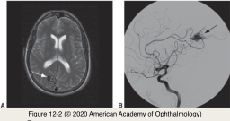

# 5.12.2. Head, Ocular, & Facial Pain (II): Migraine (II)

## Images

## Hierarchy

- Evaluation of patients with migraine
  - neuroimaging studies unlikely to show an intracranial abnormality
    - typical migraine
      - alternating hemicranial headaches
        - suggests a benign etiology
    - normal neurologic and ophthalmic examination
  - indications for additional evaluation
    - headache or aura always occurring on the same side
      - most patients with headaches that always occur on the same side of the head are also likely to have migraine
    - headache preceding the aura
    - neurologic deficit, including visual field defect, persisting after aura resolves
      - importance of visual field testing in the evaluation of patients with presumed migraine
    - features of aura are atypical
      - 1 aura/day
      - lack of expansion of or change in aura
      - duration <5 minutes or >60 minutes
    - occasionally, a mass lesion or a large vascular malformation is heralded by typical migraine symptoms
  - referral of patients with suspicious headaches to a neurologist is prudent
- Treatment of migraine
  - elimiate precipitating or contributing factors
    - foods
      - chocolate
      - nitrates
      - monosodium glutamate
        - flavor enhancer
          - found naturally in tomatoes, cheese, and other foods
      - aged cheese
      - caffeine
      - red wine and other alcoholic beverages
      - aspartame-based sweeteners
      - nuts
      - shellfish
    - estrogens and oral contraceptives
      - temporal relationship between hormone therapy and migraine suggests a causal relationship
    - other environmental triggers
      - stress
      - relief from stress
      - change in sleep patterns
      - strong scents such as perfumes
      - cigarette smoke
      - exercise
  - treatment of acute symptoms
    - serotonin 5-HT1B/1D-receptor agonists (triptans)
      - drugs (triptans)
        - sumatriptan
        - rizatriptan
        - zolmitriptan
        - frovatriptan
        - almotriptan
      - ± contraindicated with basilar-type migraine
    - nonsteroidal anti-inflammatory drugs (NSAIDs)
      - not used for patients with suspected or known coronary artery disease
        - can cause myocardial infarction
          - rare
    - dihydroergotamine
    - antiemetic drugs
      - combination drugs that include caffeine
        - long-term caffeine intake worsens headaches!
    - analgesic medications should be prescribed with caution
      - analgesic rebound headache
        - constant headache that is relieved only with the continuous use of pain medications
        - use of pain medications > 15 days/month
          - a thorough medication history from patients with headache is important
        - requires the withdrawal of analgesics
        - hospitalization may be needed
  - prophylactic treatment
    - if headaches disrupt activities of daily living
    - topiramate
      - antiepileptic GABA (gamma-aminobutyric acid) agonist
      - beta-blockers
        - syndrome characterized by acute myopic shift (>6 D) and acute bilateral angle-closure glaucoma
    - calcium channel blockers
    - tricyclic antidepressants
    - selective serotonin reuptake inhibitors (SSRIs)
    - sodium valproate
    - gabapentin
    - NSAIDs
      - potential for causing analgesic rebound headaches!
    - oral administration of magnesium and riboflavin
    - pericranial botulinum toxin injections
- Tension-type headache
  - chronic
  - may be associated with depression
  - precipitated by stress
  - aching or viselike
  - worse at the end of the day
  - treatment for tension-type headaches
    - tricyclic antidepressants
    - topiramate
    - gabapentin
    - muscle relaxants
    - NSAIDs
    - forms of biofeedback
