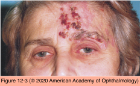

# 5.12.4. Head, Ocular, & Facial Pain (IV): Facial Pain

## Images

## Hierarchy

- Mental Nerve Neuropathy
  - pain + facial numbness
    - painful "numb chin"
  - etiology
    - inflammatory
      - sarcoidosis
      - collagen vascular diseases
      - lymphoma
        - periodontal disease
    - neoplastic
      - plasmacytoma
      - osteosarcoma
      - fibrosarcoma
      - metastatic breast carcinoma
    - sickle cell disease
      - metastatic lung and prostate carcinoma
    - trauma
- General
  - ischemia
    - carotid dissection
    - microvascular cranial nerve palsy
  - headache
    - pain in the eye area is most often a manifestation of a headache
    - occipital neuralgia
      - pain and tenderness over the greater occipital nerve
      - radiates to the ipsilateral eye
  - facial pain
    - dental disorders
    - sinus disease
    - trigeminal neuralgia
    - glossopharyngeal neuralgia
    - temporomandibular joint (TMJ) syndrome
    - carotidynia
    - herpes zoster neuralgia
    - giant cell arteritis
      - onset of facial pain in an elderly patient
    - malignancy
      - nasopharyngeal carcinoma
      - metastatic carcinoma
        - affecting the trigeminal nerve or the dura at the base of the brain
    - atypical facial pain
      - constant facial pain
      - deep and boring
      - no etiology
- Neoplastic Processes
  - pain + facial numbness
  - facial cutaneous malignancy
    - perineural invasion
      - r/o neoplasms affecting trigeminal nerve in area of cavernous sinus and Meckel cave
      - progressive pain, numbness, and multiple cranial nerve palsies
- Herpes Zoster Ophthalmicus
  - vesicular eruption
    - trigeminal dermatomes
    - occasionally, no vesicles are apparent
      - zoster sine herpete
  - pain
    - aching or burning
    - may be exacerbated by concomitant iritis
      - may arise in affected region days before the vesicular eruption
    - may persist long after resolution of the acute infection
      - postherpetic neuralgia
  - management
    - antiviral drugs
      - treatment during the acute phase may decrease the risk of severe postherpetic neuralgia
    - medical treatment for pain
      - pregabalin
      - gabapentin
      - tricyclic antidepressants
      - topical lidocaine patch 5%
      - difficult to treat
    - zoster vaccine
      - immunocompetent persons aged ≥60 years
      - significantly reduces incidence of herpes zoster
      - markedly decreases incidence and morbidity of postherpetic neuralgia
- Trigeminal Neuralgia
  - "tic douloureux"
  - etiology
    - vascular compression of CN V
      - 80%–90%
    - demyelinating disease
    - posterior fossa mass lesion
  - precipitating factors
    - chewing
    - tooth brushing
    - cold wind
  - clinical presentation
    - middle age or later
    - unilateral (95%)
    - paroxysmal burning or electric shock–like jabs
      - seconds to minutes
      - ± periods of remission
    - maxillary or mandibular distribution of CN V
      - involvement of the ophthalmic division alone is rare (<5%)
    - sensory function in the face should be normal
      - any abnormality increases likelihood of a neoplasm
  - all patients should have neuroimaging of the posterior fossa
    - preferably with MRI
  - treatment
    - medical
      - gabapentin
      - pregabalin
      - carbamazepine
      - phenytoin
      - baclofen
      - clonazepam
      - valproic acid
    - surgical
      - selective destruction of trigeminal fibers (rhizotomy)
      - surgical decompression of CN V
- Carotid Dissection
  - pain localized to the face
  - sympathetic dysfunction (Horner syndrome)
- Temporomandibular Disease
  - joint pain
    - exacerbated by
      - chewing
      - talking
    - limited jaw opening
    - click or pop
  - muscle pain
    - more difficult to diagnose
    - may be referred to the ear, preauricular area, or neck
  - jaw pain or claudication in an elderly patient may be an early symptom of giant cell arteritis
- Glossopharyngeal Neuralgia
  - unilateral
  - precipitating factors
    - swallowing
    - pungent flavors
  - paroxysmal pain
    - region of the larynx, tongue, tonsil, and ear
  - ± hoarseness and coughing
  - treatment
    - similar to trigeminal neuralgia
    - microvascular decompression
- Occipital Neuralgia
  - paroxysmal stabbing pain
  - distribution of the greater or lesser occipital nerves
  - tenderness over the affected nerve
  - injection of local anesthetic drugs
- carotidynia
  - pain arising from the cervical carotid artery
  - neck pain that radiates to the ipsilateral face and ear
    - carotid dissection must be excluded
