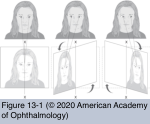
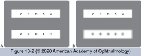
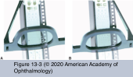

# 5.13.1. Nonorganic Ophthalmic Disorders (I): Examination Techniques (I)

## Images

## Hierarchy

- General
  - somatic manifestations of psychogenic origin may account for ≥10% of patient visits to family physicians
  - terminology
    - functional
    - nonphysiologic
    - nonorganic
  - Malingering
    - willful feigning or exaggeration of symptoms
    - Münchausen syndrome
      - intentional induction of physical damage
      - secondary psychological gain
    - malingering cannot always be clearly differentiated from hysteria
      - both are tested using the same techniques to determine the validity of the symptoms
  - Hysteria
    - subconscious expression of nonorganic signs or symptoms
    - “la belle indifference”
      - patients are often unconcerned about their incapacitating symptoms
  - Nonorganic overlay
    - patients with actual organic disease may also exhibit superimposed nonorganic behavior
  - Approach
    - “everything counts” is the guiding principle
      - in a tertiary neuro-ophthalmic practice, patients who wore sunglasses to their appointments were more likely to have nonorganic vision loss
    - history taking
      - show empathy
      - listen actively
      - carefully record the patient’s story
      - look for potential secondary gain factors during the history
      - patient has "positive” review of ophthalmic symptoms
        - patient is suggestible during the history-taking process
    - observe patient’s general behavior and ocular capabilities continuously
      - can he/she find and shake the physician’s silently outstretched hand?
      - Can the patient successfully ambulate into the room/chair?
    - mismatch between subjective complaints and objective findings
      - high index of suspicion when the pattern of vision loss does not fit the common sequence of known diseases
      - suspicion increases if the ophthalmic examination does not uncover relevant objective abnormalities
      - diagnosis confirmed when the patient does something that should not be possible based on the stated symptoms
    - patients may be more focused on impending litigation or disability determination than on the diagnosis or treatment
    - misdirection
      - some examination techniques rely on the fact that the patient believes a particular eye or function is being tested but in reality the examiner is trying to confirm a nonorganic disorder
      - other tests may yield results that suggest the patient is not cooperating
- afferent visual pathway
  - bilateral no light perception
    - nonvisual tasks
      - patient’s inability to perform nonvisual tasks
        - failure to sign a paper
        - failure to adequately perform a finger-to-nose test
    - pupillary reaction
      - a normal pupillary reaction suggests that the anterior visual pathways are intact
        - in the absence of systemic neurologic diseases
        - does not prove the loss is nonorganic !
          - r/o involvement of postgeniculate pathways (optic radiations or occipital cortex)
      - aversive light reaction establishes at least some level of afferent input
    - optokinetic nystagmus (OKN) drum
      - slowly rotate an OKN drum in front of patient
        - if eyes move with the drum, a nonorganic component has been established
          - malingerers can purposely minimize/prevent the response by looking around or focusing past the drum
    - mirror test
      - large mirror is slowly rotated side to side in front of the patient
        - examiner notes eye movement with the mirror
    - electrophysiologic testing
      - visual evoked potential (VEP)
        - both false-positive and false-negative results are possible
          - patients can willfully suppress a visual evoked response
            - an abnormal pattern-reversal VEP response in a patient with normal examination findings should not, by itself, lead to diagnosis of organic defect
            - inattention
            - lack of concentration
            - meditation
        - references
          - normal VEP results + normal clinical examination findings support the diagnosis of nonorganic disorder
  - monocular no light perception
    - all of the tests described for bilateral no light perception may be performed unilaterally
    - relative afferent pupillary defect
      - absence of RAPD substantially increases, but does not confirm, suspicion when eye examination findings are normal
    - base-out prism test
      - 4–6 Δ prism is placed base-out in front of 1 eye with both eyes open
        - inward shift of the "bad" eye indicates vision
    - vertical prism dissociation test
      - 4 Δ prism is placed base-down in front of the “good” eye
        - if the subject has vision in both eyes, 2 images should be seen, one above the other
      - references
    - confusion tests
      - fogging test
        - plus and minus spheres (4–6 D) in front of the “bad” eye
        - plus and minus cylinders (4–6 D) with their axes aligned in front of the other eye
          - patient is asked to read the chart while the front lenses are rotated
            - on the cylinder side (good eye), vision will become severely blurred as the axes are rotated
      - red-green test
        - duochrome (Worth 4-dot) glasses
        - red lens over the “bad” eye
        - red-green filter is then placed over the Snellen chart
        - green lens will prevent the good eye from seeing the red background letters
          - if the red letters are read, the patient is reading with the “nonseeing” eye
      - polarized lens test
        - patient wears polarized lenses while reading a specially projected chart with corresponding polarized filters
        - letters or lines may be selected that indicate the patient is reading with the “bad” eye
  - monocular reduced vision
    - more challenging
    - clinician must convincingly demonstrate better visual acuity than initially claimed
      - simply demonstrating that the patient can read at all is not sufficient
    - confusion tests
      - many of the tests for binocular or monocular no light perception can be applied to monocular (and binocular) reduced vision
    - stereopsis
      - presence of stereopsis indicates at least some vision in both eyes
        - See Table 13-1
  - binocular reduced vision
    - most difficult nonorganic vision loss to address
    - bottom-up acuity
      - begins with visual acuity determination on the smallest line (20/10)
      - examiner announces use of a “larger line” and then goes to the 20/15 line and several different 20/20 lines
      - examiner continually expresses disbelief that such “large” letters cannot be identified
      - by the time “very large letters” (ie, 20/50) are reached, the patient often can read optotypes much smaller than initially identified
      - variation of the bottom-up visual acuity technique
        - to demonstrate an improvement in visual acuity
        - 1⁄8 small ( D) plus and minus lenses are alternately added and subtracted while the patient is asked how many letters are visible and what shape they have
    - “visual aids”
      - have the patient wear trial frames with 4 lenses equaling the correct prescription
        - suggest that they are special magnifying lenses
      - potential acuity meter
        - presented as a means of “bypassing the visual block"
    - use of alternative charts
      - patients may be persuaded to see substantially better by a switch in optotypes
    - specialty charts
      - top line in 50 optotype instead of 400 optotype
      - alternatively, the standard chart may be moved farther away
- pupils and accommodation
  - changes in pupil size
    - fixed dilated pupil
      - etiology
        - pharmacologic blockade
          - inadvertent or purposeful application of mydriatic/cycloplegic eyedrops
          - touching eyes with fingers contaminated through use of a scopolamine patch
          - manipulating certain plants that contain parasympatholytic drugs
        - oculomotor nerve palsy
        - Adie tonic pupil
      - pilocarpine test
        - pupil remains dilated
          - pharmacologic blockade
        - pupil constricts
          - third nerve palsy
          - Adie pupil
    - widely dilated pupils may be observed in young patients
      - even with diluted pilocarpine
    - few patients are able to voluntarily dilate both pupils
    - intermittent miosis occurs in spasm of the near reflex
  - changes in accommodation
    - weakness or paralysis of accommodation
      - inability to read clearly even in the presence of an appropriate plus lens
        - failure of patient with normal distance vision to read despite appropriate near vision correction raises the possibility of a nonorganic condition
      - primarily in children and young adults
    - spasm of accommodation
      - observed with the syndrome of spasm of the near reflex
      - can produce 8–10 D of myopia
        - report blurred distance vision
        - refraction without and with cycloplegia establishes the presence of induced myopia
