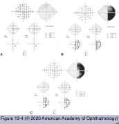
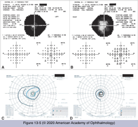
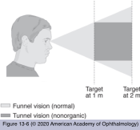

# 5.13.1. Nonorganic Ophthalmic Disorders (I): Examination Techniques

## Images

## Hierarchy

- eyelid position and function
  - ptosis
    - can usually be distinguished by the position of the brow
      - true ptosis
        - brow is usually elevated
      - orbicularis overactivity
        - brow is lowered
    - with upward gaze, the ptosis will “resolve”
      - often the patient will not cooperate
        - examiner can use his/her thumb to elevate the ptotic eyelid and the patient will then look upward
          - examiner’s thumb is then slowly moved away
            - if the ptosis returns, the condition may be organic
            - if ptosis “resolves,” it is nonorganic
  - blepharospasm
    - unilateral or bilateral
    - children or young adults
    - triggered by an emotionally traumatic event
    - may cause nonorganic ptosis
    - pressure over the supraorbital notch is often useful in raising the eyelids
- Visual field defect
  - automated perimetry testing
    - machines are quite easy to fool
      - no characteristic changes in automated perimetry confirm the suspicion of nonorganic deficit
        - except patient with monocular defect that respects the vertical midline
          - if repeating the field testing with both eyes open produces a similar, or even incomplete, defect, a nonorganic component is present
      - central scotomata are extremely rare in nonorganic vision loss and warrant further evaluation
    - references
  - confrontation testing
    - the area where the patient “can’t see” is carefully identified
      - patient is tested for “motility”
        - accurate saccades to nonauditory targets in the "nonseeing" field indicate an intact visual field
      - patient is asked to report “none” when no fingers are seen in the “nonseeing” field
        - a response of “none” each time the fingers are put up confirms vision in that area
  - Goldmann perimetry testing
    - the visual field is tested in a continuous fashion in a clockwise or counterclockwise direction starting with the I4e stimulus
    - a common nonorganic response shows a spiraling isopter getting closer and closer to fixation as testing continues
      - as larger stimuli (III4e and V4e) are employed, there is often further constriction, resulting in overlapping isopters
    - make sure there is no step across the vertical or nasal horizontal midline
      - A step across the midline may indicate that at least some physiologic component is present
  - Tangent screen testing
    - tested with a 9-mm white stimulus at 1 m
      - patient is moved back to 2 m and tested with an 18-mm white stimulus
        - failure of field to expand to twice the original size indicates nonorganic component
          - tubular or gun-barrel field
- ocular motility and alignment
  - voluntary flutter (“nystagmus”)
    - rapid frequency and low amplitude eye movements
      - brief bursts
      - irregular
      - no slow phase
  - gaze palsy
    - claimed gaze palsies may be overcome by
      - oculocephalic reflex (doll’s head phenomenon)
      - optokinetic testing
      - mirror tracking
      - caloric testing
  - spasm of the near reflex
    - episodes of intermittent convergence, increased accommodation, and miosis
    - patients generally complain of diplopia and, at times, micropsia
    - features aiding in diagnosis
      - lack of other neuro-ophthalmic abnormalities
      - miosis with convergence
      - variability of the eye movements (convergence)
      - presence of full abduction when ductions are examined with
        - 1 eye occluded
        - oculocephalic testing
    - may be mistaken for
      - unilateral or bilateral sixth nerve palsies
      - divergence insufficiency
      - horizontal gaze paresis
      - ocular myasthenia
    - etiology
      - almost always observed in patients with nonorganic disturbances
      - has been associated with
        - Arnold-Chiari I malformation
        - posterior fossa tumors
        - pituitary tumors
        - head trauma
- Management of the Patient With Nonorganic Complaints
  - allow patients a graceful way out of the situation
    - best managed with an understanding approach and words of encouragement
      - confrontation is seldom of benefit to either the patient or the doctor
    - reassure them that their disorder is unlikely to reflect a serious condition and will resolve over time
      - patients should be reassured of an “excellent prognosis”
      - symptoms may clear with 1 or 2 follow-up visits
    - this approach is usually more effective with children than adults
  - children may be further encouraged through the prescription of “eye rest”
    - removing the “overuse of television”
  - in patients with combined organic and nonorganic (nonorganic overlay) complaints
    - manage the organic problem
    - attempt to downplay the nonorganic portion
  - consultation with a psychiatrist or psychologist
    - for an underlying psychological illness
  - monitor a patient with what initially appears to be a nonorganic visual disturbance
    - occasionally, an organic disorder becomes apparent later
