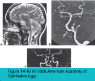
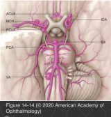
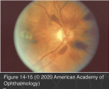

# 5.14.10. Systemic Conditions (X): Cerebrovascular Disorders (II): Cerebral Aneurysms

## Images

## Hierarchy

- Introduction
  - demographics
    - 5% of the population
    - rarely become symptomatic <20 years
    - ± familial occurrence
  - predisposing conditions
    - commonly associated with hypertension
    - arteriovenous malformations
    - coarctation of the aorta
    - polycystic kidney disease
    - connective tissue diseases
      - fibromuscular dysplasia
      - Marfan syndrome
      - Ehlers-Danlos syndrome
    - tobacco use
  - saccular/“berry” aneurysm
    - at arterial bifurcations
      - most common type
    - locations
      - supratentorial
      - infratentorial
        - 10%
          - 90%
    - size
      - “giant aneurysms”
        - aneurysms >10 mm are most likely to rupture
        - ≥25 mm
  - aneurysms arising from the internal carotid artery and basilar artery may produce neuro- ophthalmic manifestations
  - high morbidity and mortality result from aneurysm rupture
    - early detection and surgical intervention can be life-saving
- Diagnosis
  - suspected aneurysm requires urgent neuroradiologic imaging
    - consult the neuroradiologist !
  - 4-vessel study of both carotid and vertebral arteries is imperative
    - 10% of patients have multiple aneurysms !
  - CTA
    - imaging modality of choice
  - MRA
    - shows aneurysms ≥3 mm
  - MRI
    - shows most aneurysms >5 mm
  - conventional cerebral arteriography
    - high level of suspicion for aneurysm + negative finding on MRA or CTA
  - CT scan
    - immediately after aneurysm rupture to detect the presence of intraparenchymal and subarachnoid blood
    - suspected subarachnoid hemorrhage + negative CT finding
      - CTA
      - lumbar puncture
        - should not be attempted in the presence of midline shift or evidence of cerebral (uncal) herniation
    - enhanced CT scan can show large aneurysms
      - not an acceptable screening test for unruptured aneurysms !
  - to screen for unruptured aneurysms
    - less expensive and associated with lower morbidity than conventional angiography
- Prognosis
  - risk of rupture is related to size
    - <10 mm
      - <0.05% per year
    - ≥25 mm
      - 6% rupture in the first year
  - once an aneurysm has ruptured, morbidity and mortality are high
    - 30% die at the time of rupture
    - untreated, another 33% die within 6 months
    - 15% more die within 10 years
    - many of those who survive suffer severe neurologic deficits
  - references
- Clinical presentation
  - unruptured aneurysms
    - progressive neurologic dysfunction
      - particularly giant aneurysms
      - ophthalmic artery aneurysm
        - progressive unilateral optic neuropathy
        - ipsilateral periocular pain
      - anterior communicating artery aneurysm
        - optic chiasm or optic tract compression
      - aneurysm at the junction of the internal carotid and posterior communicating arteries
        - ipsilateral third nerve palsy
      - intracavernous carotid artery aneurysm
        - fusiform enlargement (dolichoectasia)
          - not berry type
            - complete third nerve palsy with pupil involvement or partial third nerve palsy ± pupil involvement should raise suspicion of an aneurysm and prompt immediate neuroimaging
        - cavernous sinus syndrome
          - CN III, IV, VI and ophthalmic branch of CN V
            - singly or in combination
        - often produce facial pain
          - typically do not rupture but cause progressive neurologic dysfunction
          - consider in the differential diagnosis of painful ophthalmoplegia
    - pain is not a helpful symptom
      - may be absent with unruptured aneurysms
    - other neurologic findings
      - TIA
        - may occur with cranial nerve palsies from microvascular ischemia
      - cerebral infarction
      - seizures
      - may be caused by flow phenomena or distal embolization
  - ruptured aneurysm
    - neurosurgical emergency
    - subarachnoid or intraparenchymal hemorrhage
    - ± “sentinel bleed” before the major rupture
    - headache
      - “the worst of my life”
      - localized or generalized
    - nausea, vomiting
    - fever
      - neck stiffness
        - meningeal irritation from subarachnoid blood
      - rare
    - elevated intracranial pressure
      - papilledema
      - sixth nerve palsies
    - altered mental status
      - disoriented, lethargic, or comatose
    - ocular hemorrhage
      - may accompany subarachnoid hemorrhage
      - location
        - Intraretinal
        - preretinal
          - subhyaloid
        - vitreous
        - subconjunctival
        - orbital
        - optic nerve sheath
      - Terson syndrome
        - subarachnoid hemorrhage + ocular hemorrhage
- Treatment
  - treatment of symptomatic aneurysms before rupture is ideal
  - supportive treatment to stabilize the patient
    - lower intracranial pressure
      - hyperventilation
      - mannitol
        - calcium channel blockers
    - treatment of cerebral vasospasm
      - blood volume expansion
      - control of blood pressure
  - definitive treatment
    - surgical clipping of the aneurysm
    - intravascular techniques
      - coil embolization
      - stent placement
      - are replacing clipping as the preferred treatment
    - wrapping of the aneurysm wall
      - when aneurysm clipping is technically impossible
    - ligation of the feeding artery or carotid artery
      - when aneurysm clipping is technically impossible
- poor prognostic sign
