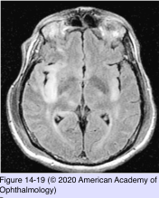
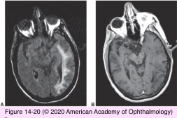

# 5.14.13. Systemic Conditions (XIII): Neuro-Ophthalmic Manifestations of Infectious Diseases (I)

## Images

## Hierarchy

- Herpesvirus
  - organisms
    - herpes simplex virus (human herpesvirus 1 and 2)
    - herpes varicella-zoster virus
  - neuro-ophthalmic findings are uncommon with herpesvirus infection
  - necrotizing retinitis
    - symptoms
      - photophobia
      - ocular pain
      - floaters
      - decreased visual acuity
    - panuveitis
    - vitritis
    - retinal arteritis
    - disc edema
    - initially spares the posterior pole
  - CNS encephalitis
    - most common neurologic manifestation of herpes infection
  - radiculitis
    - herpes zoster ophthalmicus
    - Ramsay Hunt syndrome
- Syphilis
  - syphilis may accompany HIV infection
  - ophthalmic presentations
    - optic neuritis
      - papillitis
    - arterial and venous occlusions
    - vasculitis
      - necrotizing vasculitis
    - chorioretinitis
    - uveitis
    - retinal hemorrhages
  - meningovascular syphilis
    - visual field defects
    - ocular motility disorders (ocular motor cranial nerve palsies)
  - CSF examination
    - positive syphilis serology
      - false-negative and false-positive results are more common in patients infected with HIV
      - CSF VDRL test alone cannot be relied upon to confirm CNS infection
        - VDRL is non-treponemal but more specific for neurosyphylis
      - CSF examination
        - every case of syphilitic uveitis
        - (+) CSF VDRL
          - diagnostic of neurosyphilis
            - high specificity
          - low sensitivity
            - +- nonreactive in some cases of neurosyphilis
          - repeat every 6 months until the cell count, protein, and VDRL results return to normal
        - CSF FTA-ABS
          - highly sensitive
            - useful in excluding neurosyphilis
          - FTA-ABS is treponemal but less specific for neurosyphylis
    - elevated protein level
    - pleocytosis
      - aqueous penicillin G
        - 12–24 million U/day IV for 10–14 days
  - treatment
    - reexamine the CSF to monitor treatment effectiveness
- Progressive Multifocal Leukoencephalopathy (PML)
  - JC virus
    - polyomavirus
    - destroys oligodendrocytes
  - predisposing conditions
    - lymphoproliferative disorders
    - impaired cell-mediated immunity
    - immunomodulating medications
      - natalizumab
    - HIV
      - 1–4% of HIV-infected patients
  - pathology
    - involves subcortical white matter
    - gray matter is relatively spared
  - neuro-ophthalmic manifestations
    - central visual pathways and ocular motor fibers can be affected
    - homonymous hemianopia
    - blurred vision
    - cerebral blindness
    - prosopagnosia
    - diplopia
  - other neurologic findings
    - altered mental status
    - ataxia
    - dementia
    - hemiparesis
    - focal deficits
  - MRI
    - areas of demyelination
      - parieto-occipital region
      - focal or confluent nonenhancing lesions
  - treatment
    - correcting the underlying immune deficiency state
    - plasma exchange
      - may be helpful
    - prognosis is poor
- Mycobacterium
  - organisms
    - Mycobacterium tuberculosis
    - Mycobacterium avium-intracellulare complex
  - tuberculous meningitis
    - photophobia
    - third and sixth nerve paresis
    - papilledema
    - retrobulbar optic neuritis
    - anisocoria
    - obliterative endarteritis
      - cerebral infarction
    - neuroimaging
      - hydrocephalus
      - abscess formation
      - granulomas
      - enhancement of the basal meninges with contrast administration
