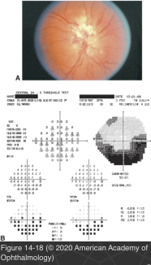

# 5.14.14. Systemic Conditions (XIV): Neuro-Ophthalmic Manifestations of Infectious Diseases (II):HIV Infection

## Images

## Hierarchy

- pathogenesis of neuro-ophthalmic disorders
  - direct infection
  - indirect causes
    - secondary opportunistic infections
    - malignancy
    - microvasculopathy
    - uveitis
- CNS lymphoma
  - second most common malignancy in patients with AIDS
    - most common neoplasm to affect the CNS
    - Kaposi sarcoma
      - most common AIDS-associated neoplasia
        - eyelid or conjunctiva
  - high-grade B-cell non-Hodgkin lymphoma
  - clinical presentation
    - diplopia
      - third, fourth, or sixth nerve involvement
    - lymphomatous infiltration of the orbit and optic nerve
      - disc swelling
      - loss of vision
  - diagnosis
    - CSF study
      - neoplastic lymphomatous cells in the spinal fluid
    - stereotactic brain or meningeal biopsy
    - MRI
      - periventricular with subependymal spread
        - MRI changes may resemble those of toxoplasmosis
  - Treatment
    - radiotherapy + chemotherapy
- direct HIV infection
  - acute aseptic meningitis/meningoencephalitis
    - 5%–10% of patients soon after initial HIV infection
    - headache
    - fever
    - meningeal signs
    - mononucleosis-like syndrome
    - other occasional findings
      - altered mental status
      - seizures
      - optic neuropathy
      - cranial neuropathies
        - most commonly seventh nerve paresis
          - like sarcoidosis
  - HIV encephalopathy
    - other names
      - "AIDS dementia complex"
      - "HIV-associated neurocognitive disorder"
    - clinical presentation
      - behavior changes
        - impaired memory and concentration
      - mental slowness
      - saccadic intrusions (square-wave jerks)
      - late manifestations
        - profound dementia
        - behavior changes
        - psychosis
        - psychomotor impairment
        - weakness
        - visual neglect
        - visual hallucinations
        - seizures
        - tremor
        - optic neuropathy
    - ocular signs of HIV
      - cotton-wool spots
      - perivasculitis
      - retinal hemorrhages
    - MRI scanning
      - cerebral atrophy
      - areas of white matter hyperintensity on T2- weighted images
        - areas of demyelination produced by the virus
- cytomegalovirus (CMV) infection
  - common opportunistic infection in HIV-infected patients
  - CMV retinitis
    - often the presenting manifestation of untreated advanced HIV infection
    - major cause of vision loss
      - only in patients with extremely low CD4+ T- lymphocyte cell counts
  - CNS findings
    - optic neuritis
      - anterior optic nerve infection
        - acute loss of vision
        - optic disc swelling
        - usually in patients with severe CMV retinitis
        - sometimes with minimal retinitis
      - posterior optic neuropathy
        - rare
        - slowly progressive loss of vision without disc edema
    - brainstem encephalitis
      - ptosis
      - internuclear ophthalmoplegia
      - ocular cranial nerve palsies
      - horizontal and vertical gaze paresis
      - nystagmus
  - diagnosis
    - clinical
    - serology
      - may indicate elevations or be inconclusive
    - culture
    - PCR of CSF may be an important molecular tool
